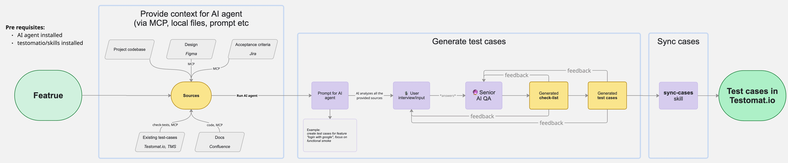

# Generate test cases from requirements

### 🤔 Problem: need test cases for new feature

### ✅ Solution: use testomatio skills

Basically, this flow is pretty simple: you have requirements and you need test cases. To achieve this, follow the steps below.


 
## 𓊍 Steps

0. [Install](../../install-details.md) testomatio skills.

1. Run any AI agent and ask to generate test cases. Follow its instructions.

That's it. Everything will be done under the hood. As a result you will have test cases in Testomat.io (and/or `.test.md` files). But let's dive into details.

## Steps in details

The full flow looks like this:



### 0. Install skills

The easiest way to install skills:

```bash
npx skills add testomatio/skills
```

We recommend to select all skills to get more functionality.

### 1. Prepare context

Before running the agent, give it access to your project by configuring MCP tools:

- **Task/ticket tracker** (Jira, ClickUp, Linear, Asana…)
- **Documentation** (Confluence, Notion, Google Docs…)
- **Design** (Figma, Miro, Sketch…)
- **Code repository** (GitHub, GitLab, Bitbucket…)
- **Test management** (e.g. Testomat.io; use `sync-cases` skill to download existing cases)
- **Live app URL** — lets the agent browse the UI for extra context

> **No MCP?** Paste the relevant content directly into your prompt (ticket text, Figma screenshot) or store it in a file. The agent works with whatever you provide.

Thus agent will be able to understand your project and context, retrieve necessary information and generate test cases accordingly. Usually, MCP should be configured before running the AI agent.

### 2. Start the agent

Ask the agent naturally — no special command needed. The `generate-cases` skill loads automatically (or you can invoke it explicitly).

**Example prompts:**

```text
Generate test cases for the feature described in JIR-123

Create a smoke checklist for the login page. Figma design: [link]

Write exhaustive tests for the permissions system, focus on security edge cases (pentest)
```

### 3. Follow the multi-step test cases generation workflow

The agent guides you through **multiple interactive checkpoints** — it won't move to the next stage without your sign-off.

Depending on your needs, you can let the agent make decisions automatically or steer it with your own feedback at every step.

| Checkpoint               | What happens                                                                                                                                      |
| ------------------------ | ------------------------------------------------------------------------------------------------------------------------------------------------- |
| **Context review**       | Agent shows the sources it found; you confirm or add more                                                                                         |
| **Coverage scope**       | 🚀 Smoke / ⚖️ Balanced / 🧨 Exhaustive / ✏️ Other; agent computes estimated test counts for your feature                                          |
| **Tester role**          | Pick an agent proposed role if you want to focus on specific aspect of testing e.g. optimist, nerd, psycho (or just proceed with the default one) |
| **Checklist approval**   | Review the structured checklist; provide your feedback                                                                                            |
| **Test case generation** | Detailed test cases written to `.test.md` files                                                                                                   |
| **Upload suggestion**    | Agent prompts you to push cases to Testomat.io via `sync-cases`                                                                                   |

### 4. Test case generation

The approved checklist converts to detailed **`feature-name.test.md`** files.

### 5. Summary & upload to Testomat.io

The agent shows a table of generated files and suggests uploading to Testomat.io via the `sync-cases` skill.

**The agent guides you** — you never need to know the skill internals to get good results.
