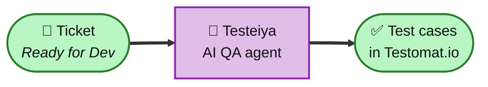
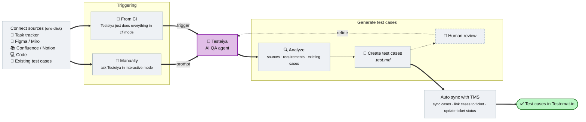

# Test cases from Jira tickets (task tracker → Testomat.io)

### 🤔 Problem: every new ticket needs test cases — and a human writes them manually

A story lands in your tracker. QA engineer opens it, re-reads the acceptance criteria, checks the design, writes a checklist, types out test cases, and copies them into the TMS. It's slow, it happens late, and coverage depends on who picked up the ticket.

### ✅ Solution: use [Testeiya](https://testomat.ai/testeiya/) AI QA agent

Trigger it manually or automatically on ticket description/acceptance criteria is ready.



## Why use this approach

- **Get feedback about acceptance criteria quality early.** Testeiya will flag missing, ambiguous, or untestable acceptance criteria.
- **Shift-left.** Test design starts the moment a story is "ready", not days later.
- **Traceability.** Ticket ⇄ Testomat.io ⇄ Code. Everything stays linked, so coverage and impact are always in sight.
- **Consistent quality.** Every story gets the same senior-level checklist, regardless of who's on shift.
- **Human vs AI.** People review, refine and approve — the agent does the typing and the lookups. Or you can rely on it completely and automate the entire process.

## When to trigger?

- Ticket description is ready: trigger to review acceptance criteria and generate test cases.
- Not sure if description is ok? Trigger to review acceptance criteria and detect potential problems/gaps/ambiguities.

## Who triggers it?

- Start with a human, hand off to automation as trust grows.
- Delegate to QA, PO, DEV or other team members. Testeiya is pretty simple in usage, but very powerful in capabilities.

## 𓊍 Steps (the short version)

0. Install **[Testeiya](https://testomat.ai/testeiya/)** and connect sources: **Jira**, **Testomat.io** (and any others like Figma/Miro, Confluence/Notion, code repository, etc).
1. Pick a "ready" ticket and prompt Testeiya (manually at first): *"Draft test cases for JIR-123"*.
2. Review Testeiya's checklist and cases, then let it sync to Testomat.io and link on the ticket.

That's it — Testeiya does the context-gathering, drafting, deduplication and sync with TMS under the hood.

## The full flow



## Steps in detail

### 0. Install & connect

Install **[Testeiya](https://testomat.ai/testeiya/)** (desktop app or CLI). It ships with the testomatio skills built in. Then **one-click connect** the sources it needs:

- **Task tracker** — Jira (or Linear / ClickUp / Asana / GitHub Issues). Gives Testeiya the ticket, its acceptance criteria, and linked items.
- **Testomat.io** — read existing cases (to analyze for overlap) and push the new ones; browse projects and launch runs without leaving Testeiya.
- **Figma / Miro** for design, plus **Confluence/Notion** for documentation and your **code repo**. Richer context = sharper cases.

> **Can't connect a source?** Paste the ticket text or a design screenshot straight into your Testeiya prompt, or drop a file. The agent works with whatever you give it — MCP just automates the gathering.

### 1. Trigger Testeiya

There are two ways to kick off the flow: manually or automatically (on some action like moving ticket to specified status).

**Manually (start here).** Once a ticket's description / acceptance criteria are ready, open Testeiya and ask in plain language. It picks the right skill (`qa-write-test-cases`) and runs it against your connected sources:

```text
Draft test cases for JIR-123, focus on functional smoke
Create an exhaustive checklist for the bug in LIN-88, focus on regression around the fix
```

**Automatically.** On some action like moving ticket to specified status.

*Automation setup flow will be described later.*

### 2. Generate test cases

Testeiya runs the test cases generation workflow:

| Step | What happens |
| --- | --- |
| **🔍 Analyze** | Reads the connected **sources**, checks the **acceptance criteria** for gaps (flagging anything missing, ambiguous, or untestable — shift-left), and scans **existing** Testomat.io cases (`detect-duplicate-test-cases`) so new ones extend coverage instead of duplicating it. |
| **🎯 Pick coverage scope** | 🚀 Smoke / ⚖️ Balanced / 🧨 Exhaustive — Testeiya estimates how many tests each scope yields for the ticket. |
| **📝 Write test cases** | Detailed cases saved to `JIR-123-feature.test.md`. |
| **👤 Review** *(optional)* | You review and refine before publishing; the agent loops back on your feedback. |

In **desktop (interactive) mode** Testeiya won't advance without your sign-off — automate the decisions you trust, steer the ones you don't. In **CLI / CI mode** it runs autonomously and surfaces the result for review on the PR instead.

### 3. Auto-sync with Testomat.io (TMS)

This is what makes it a *flow* and not a one-off generation — Testeiya does it automatically:

1. **Sync** the approved cases to Testomat.io (`sync-test-cases-with-tms`).
2. **Link** them back to the ticket (`JIR-123`) so coverage stays traceable both ways.
3. **Update the ticket status** (e.g. → *Tests Ready*) to signal the cases are in place.

Result: test cases in Testomat.io linked to `JIR-123`, and a QA engineer who reviewed instead of transcribed.
