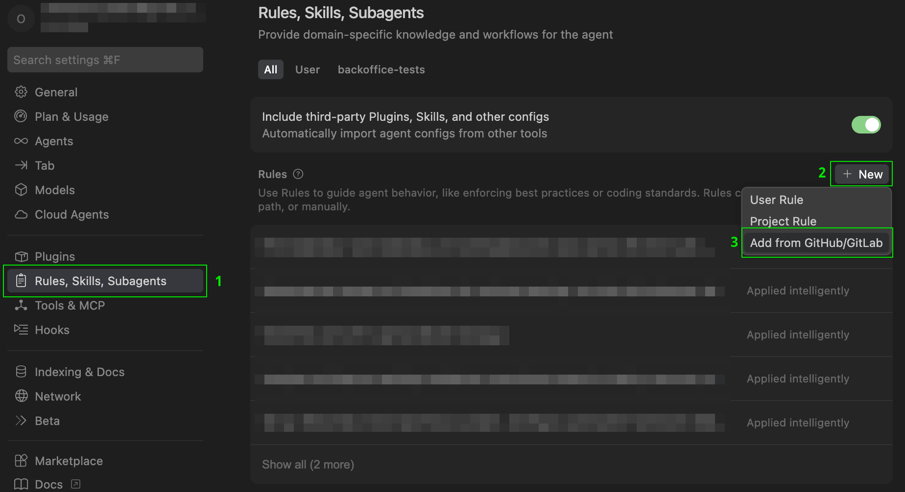

# Testomatio skills installation details

- [Most agentic tools](#most-agentic-tools-claude-code-cursor-cline-vs-code-and-others)
- [Claude Code](#claude-code-plugin-with-marketplace)
- [Codex](#codex)
- [Cursor](#cursor)
- [VS Code / Copilot](#vs-code--copilot)

### Most agentic tools (Claude Code, Cursor, Cline, VS Code and others)

```bash
npx skills add testomatio/skills
```

To update your installed skills:

```bash
npx skills update
```

### Claude Code (plugin with marketplace)

For Claude Code skills are grouped into plugins which could be installed from the marketplace.

> All commands below should be executed in Claude Code terminal.

1. Add marketplace

```bash
/plugin marketplace add testomatio/skills
```

2. Install required plugin

```bash
/plugin install <plugin-name>@testomatio/skills
# e.g.
/plugin install test-management@testomatio/skills
```

3. Use

```bash
# invoke plugin
/test-management

# or call skill directly
/test-management:generate-test-cases

# or just use skill name
generate-test-cases

# or skill will be loaded automatically on a relevant prompt
"create test cases for login feature"
```

### Codex

Easiest way to install skills for Codex is to chat with Codex and ask something like:

`install skills from https://github.com/testomatio/skills/tree/master/skills`

or trigger `Skill Installer` in Codex chat and provide the same link `https://github.com/testomatio/skills/tree/master/skills`.

### Cursor

1. Open Cursor Settings (`Cmd+Shift+J` / `Ctrl+Shift+J`)
2. Go to **Rules/Skills/Subagents** → **New** → **Add from GitHub/GitLab**
3. Paste: `https://github.com/testomatio/skills.git`


