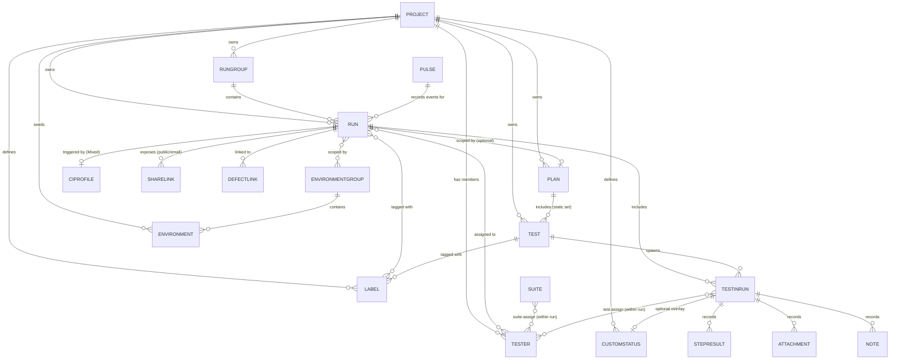

# 04 — Data Model

Entities and cardinalities observed in the Manual Tests Execution feature. This is a **logical** model — it reflects the concepts users interact with, not a physical schema. Physical field names, nullability, and exact relation tables live in the backend code (out of POC scope — see [11-integrations.md](./11-integrations.md) for what surfaces via the public API).

> **Sources.** Derived from [_ac-baseline.md](../../../test-cases/manual-tests-execution/_ac-baseline.md) + every `*-ac-delta.md`, the [03-glossary.md](./03-glossary.md), and the state diagrams in [05-state-diagrams.md](./05-state-diagrams.md). Every card identifies the UCs and ACs that read or write the entity.

## Entity-relationship diagram

## Entity catalogue

### Run
**What:** An instance of executing a set of tests at a point in time. See [Run in glossary](./03-glossary.md#run).
**States:** Pending → In-Progress → Finished; In-Progress → Terminated (via Archive of an ongoing Run, AC-76). See [05-state-diagrams.md § Run](./05-state-diagrams.md#run).
**Key attributes:** title, created-by, created-at, finished-at, status, type (Manual / Automated / Mixed — AC-68), pinned flag (AC-70), archived flag, scope (All tests / Test plan / Select tests / Without tests — [BR-4](./07-business-rules.md#br-4)), as-checklist flag (AC-96).
**Owner UCs:** [UC-01](./06-use-cases/UC-01-create-manual-run.md), [UC-02](./06-use-cases/UC-02-create-mixed-run.md), [UC-04](./06-use-cases/UC-04-finish-run.md), [UC-05](./06-use-cases/UC-05-relaunch-run.md), [UC-12](./06-use-cases/UC-12-archive-unarchive-purge.md).
**Reader UCs:** [UC-10](./06-use-cases/UC-10-manage-runs-list.md), [UC-11](./06-use-cases/UC-11-view-run-report.md).

### RunGroup
**What:** A named container for Runs with a required merge strategy. See [RunGroup](./03-glossary.md#rungroup).
**States:** active ↔ archived ([BR-9](./07-business-rules.md#br-9)).
**Key attributes:** name (required), merge strategy (required — AC-14), group type (optional), description (optional), pinned flag (AC-70).
**Cardinality:** Run →0..1 RunGroup (a Run belongs to at most one group); RunGroup → 0..∞ Runs (purge ceiling 20 000 — [BR-10](./07-business-rules.md#br-10)).
**Owner UCs:** [UC-08](./06-use-cases/UC-08-manage-rungroup.md), [UC-12](./06-use-cases/UC-12-archive-unarchive-purge.md).

### Test (catalog)
**What:** The re-usable test definition in the project's Tests tree. A Test has code or manual steps and a description; it is re-executed across Runs.
**Key attributes:** title, description, priority (ac-delta-17 of runner), labels, tags, automation code template (ac-delta-6 of report), test-level default assignee.
**Owner UCs:** Out of scope — authored in the Tests feature. Read by [UC-01](./06-use-cases/UC-01-create-manual-run.md) (scope selection), [UC-03](./06-use-cases/UC-03-execute-test-in-runner.md), [UC-11](./06-use-cases/UC-11-view-run-report.md).

### TestInRun
**What:** The per-Run instance of a Test — holds the recorded result. Conceptually a join between Run and Test with its own lifecycle (Pending → Passed / Failed / Skipped + optional CustomStatus).
**Key attributes:** standard status (PASSED / FAILED / SKIPPED / PENDING), result message, duration (auto-tracked or set-time — ac-delta-19/20 of runner), per-test assignee (within the Run's assignee set — [BR-6](./07-business-rules.md#br-6)), step results, attachments, notes, custom status overlay ([BR-5](./07-business-rules.md#br-5)).
**Owner UCs:** [UC-03](./06-use-cases/UC-03-execute-test-in-runner.md), [UC-09](./06-use-cases/UC-09-bulk-status-in-runner.md).
**Reader UCs:** [UC-11](./06-use-cases/UC-11-view-run-report.md).

### Tester (User)
**What:** A project member who can be assigned to Runs, suites, or tests.
**Roles:** Owner, Manager, QA Creator, Tester, Readonly ([02-actors-and-permissions.md](./02-actors-and-permissions.md)). Manager-role users are excluded from random-distribute auto-assign ([BR-6a](./07-business-rules.md#br-6a)).
**Cardinality:** Run ↔ Tester many-to-many (Run has ≥ 1 assignee — the creator manager by default, AC-37). TestInRun → 0..1 assignee (within the Run's assignees — [BR-6](./07-business-rules.md#br-6)).
**Owner UCs:** [UC-06](./06-use-cases/UC-06-assign-testers.md).

### EnvironmentGroup / Environment
**What:** A group of environment values (`Browser:Chrome`, `OS:Windows`) that scopes a Run. A Run may have 1..N groups; 2+ groups spawn parent-RunGroup + child Runs on Launch in Sequence / Launch All ([UC-07](./06-use-cases/UC-07-configure-environments.md), AC-49/AC-50).
**Key attributes:** group display name (derived), selected environments (multi-select — AC-46).
**Seed source:** Project Settings → Environments (AC-44, out of POC scope).
**Owner UCs:** [UC-07](./06-use-cases/UC-07-configure-environments.md).
**Reader UCs:** [UC-10](./06-use-cases/UC-10-manage-runs-list.md) (env badges / Tags & Envs column), [UC-11](./06-use-cases/UC-11-view-run-report.md) (per-env breakdown, concern A).

### Plan
**What:** A static curated set of Tests. Runs scoped as *Test plan* include the union of selected plans' tests (AC-4, AC-21).
**Owner UCs:** Out of scope (authored in the Plans feature). Read by [UC-01 A1](./06-use-cases/UC-01-create-manual-run.md#a1-test-plan-scope), [UC-04 A2](./06-use-cases/UC-04-finish-run.md#a2-edit-an-unfinished-run--tests--plans-remove-test-amend-metadata) (`+ Plans`).

### Label
**What:** A project-defined tag applied to Tests and to Runs. Bulk-applicable from Runs list Multi-Select ([UC-10 A3](./06-use-cases/UC-10-manage-runs-list.md#a3-multi-select--bulk-action), AC-71).
**Cardinality:** many-to-many with both Test and Run.

### CustomStatus
**What:** A project-defined status overlay layered on top of a standard status (PASSED / FAILED / SKIPPED). Never replaces the standard status — [BR-5](./07-business-rules.md#br-5).
**Cardinality:** TestInRun → 0..1 CustomStatus.

### StepResult / Attachment / Note
**What:** Child records of a TestInRun.
- **StepResult** — per-step PASSED / FAILED / SKIPPED marker via click cadence (AC-35, ac-delta-8 of runner).
- **Attachment** — file uploaded via browse / drag-and-drop (AC-32..AC-34, ac-delta-4..7 of runner). Deletion requires confirmation.
- **Note** — free-text comment attached to a test, a suite, or via bulk (ac-delta-10..13 of runner); convertible to a new Test (ac-delta-12).

### CIProfile
**What:** Project-level configuration that tells Testomat.io where to trigger automated execution. Consumed by Mixed Run ([UC-02](./06-use-cases/UC-02-create-mixed-run.md)) and CI-variant Relaunch ([UC-05 A4 / A5](./06-use-cases/UC-05-relaunch-run.md#a4-relaunch-failed-on-ci)).
**Cardinality:** Project → 0..N CIProfiles; Run → 0..1 triggered profile (Mixed Runs may reference; Manual Runs do not).
**Scope:** Internals are out of scope — see [11-integrations.md](./11-integrations.md) for payload / CLI surface.

### ShareLink
**What:** A Run-scoped sharing artefact — either a Share-by-Email send record, or a public-URL + passcode pair ([UC-11 A7 / A8](./06-use-cases/UC-11-view-run-report.md#a7-share-by-email), [BR-13](./07-business-rules.md#br-13)).
**Key attributes:** expiration, passcode-on flag, URL (public only), revoked flag (AC-91, ac-delta-20 of report).

### DefectLink
**What:** A link from a TestInRun to an external defect tracker (Jira / GitHub). Surfaces on the Defects tab of the Report (AC-98 — **UNCLEAR**, [13-open-questions.md § OQ-04](./13-open-questions.md#oq-04)).

### Pulse
**What:** Project activity log. Records **Deleted Run** events for permanent-delete audit (AC-81, ac-delta-18 of archive).
**Readers:** Owner / Manager audit workflow — out of POC UC scope.

## Cardinality cheatsheet

| Relation | Cardinality | Enforced by |
|---|---|---|
| Project → Run | 1..N | — |
| RunGroup → Run | 0..N (≤ 20 000 for Purge) | [BR-10](./07-business-rules.md#br-10) |
| Run → RunGroup | 0..1 | — |
| Run → TestInRun | 0..N (0 allowed via *Without tests*) | [BR-2](./07-business-rules.md#br-2) |
| Test → TestInRun | 0..N | — |
| Run → Tester (assignees) | 1..N (creator manager included) | AC-37, [BR-6](./07-business-rules.md#br-6) |
| TestInRun → Tester | 0..1 (within Run assignees) | [BR-6](./07-business-rules.md#br-6) |
| Run → EnvironmentGroup | 0..N | AC-47, [UC-07](./06-use-cases/UC-07-configure-environments.md) |
| TestInRun → CustomStatus | 0..1 (requires standard status) | [BR-5](./07-business-rules.md#br-5) |
| Run → ShareLink | 0..N | [BR-13](./07-business-rules.md#br-13) |
| Run → CIProfile | 0..1 (Mixed only) | [BR-3](./07-business-rules.md#br-3) |

## Notes on impedance

- **Pending is a TestInRun state, not a Run state** — a Run may be In-Progress while containing 0..N Pending tests. Finish coerces all of them to Skipped ([BR-7](./07-business-rules.md#br-7)).
- **Run scope is not a stored enum** — it determines *which* Tests spawn TestInRun rows at creation time ([UC-01](./06-use-cases/UC-01-create-manual-run.md) main + A1..A3). After creation, scope is not a persistent field visible on the Run; *Without tests* Runs produce zero TestInRun rows but are otherwise normal ([BR-2](./07-business-rules.md#br-2)).
- **Merge strategy lives on RunGroup, not on Run.** It governs how the Combined Report aggregates per-Test statuses across sibling Runs ([UC-08 A4](./06-use-cases/UC-08-manage-rungroup.md#a4-combined-report), AC-14).
