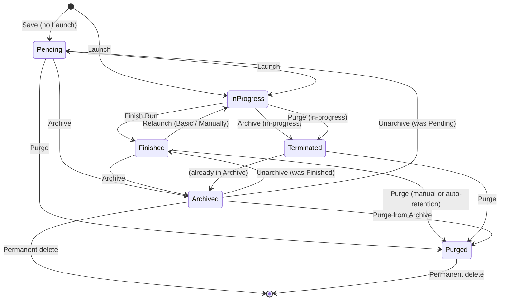
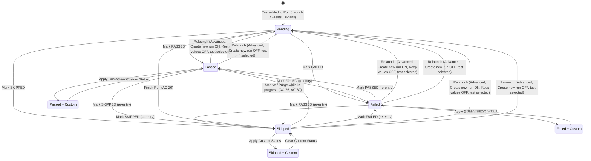

# 05 — State Diagrams

State machines Manual Tests Execution operates over. Each diagram is Mermaid `stateDiagram-v2`; transition labels name the **triggering action**, not the resulting state.

Sources: [AC-23..28](../../../test-cases/manual-tests-execution/_ac-baseline.md#run-lifecycle), [AC-58..67](../../../test-cases/manual-tests-execution/_ac-baseline.md#run-lifecycle--relaunch-variants), [AC-75..81](../../../test-cases/manual-tests-execution/_ac-baseline.md#archive--purge), `archive-and-purge-ac-delta.md`, `run-creation-ac-delta.md`.

---

## Run



### Transition notes

| Transition | AC | Notes |
|---|---|---|
| `Save` (Pending) | AC-8 | Save stores without launching. |
| `Launch` → InProgress | AC-8, AC-23 | Immediate transition. |
| `Launch` blocked | AC-9 | If Require RunGroup is enabled and no Group is selected, Launch is blocked (no transition). |
| `Finish Run` | AC-25, AC-28 | Gated by confirmation dialog. Pending tests at Finish → Skipped (AC-26) — see [Test-in-Run](#test-in-run). |
| `Relaunch (Basic / Manually)` | AC-58, AC-61 | Re-opens the same Run in Manual Runner; Run status updates after Finish. |
| `Relaunch Failed on CI / All on CI` | AC-59, AC-60 | Orchestrates CI; failed manual tests re-open in Manual Runner. Not modelled as a distinct Run state — the Run remains In-Progress until Finish. |
| `Relaunch (Advanced, Create new run: ON)` | AC-62, AC-63 | Creates a **new** Run ID — that run enters this state machine from `Pending → InProgress`. |
| `Relaunch (Advanced, Create new run: OFF)` | AC-64 | Reuses the original Run ID; selected tests reset to Pending but the Run's lifecycle stays on the Finished → InProgress edge. |
| `Launch a Copy` | AC-67 | Creates a **separate** duplicate Run (new instance of the state machine). |
| `Archive (in-progress)` | AC-76 | Run becomes Terminated, Pending tests become Skipped. |
| `Purge (in-progress)` | AC-80 | Same Terminated transition; restored Terminated Runs cannot be resumed (the `Terminated → InProgress` edge does **not** exist). |
| `Unarchive` | AC-56, ac-delta-13..15 | Restores to the pre-archive state (Pending or Finished); RunGroup unarchive cascades to all nested runs. |
| `Purge from Archive` | AC-78 | Manual purge of an already-archived Run. |
| `Permanent delete` | AC-81, ac-delta-17..18 | Irreversible; tracked in Pulse under "Deleted Run". |

### Why there is no `Terminated → InProgress`

AC-80 explicitly forbids resuming a Terminated Run. Terminated is a sink state for the *active-execution* phase; the only outbound transitions are archival-side (`Archived`, `Purged`, `Permanent delete`).

### RunGroup cascade

Archive / Unarchive / Purge on a RunGroup applies to every nested Run (AC-56..57). Each nested Run still walks its own state machine; the Group-level action is syntactic sugar that fans out to each. See [RunGroup](#rungroup).

---

## RunGroup

```mermaid
stateDiagram-v2
    [*] --> Active: Create (New Group)

    Active --> Archived: Archive (cascade to nested runs)
    Archived --> Active: Unarchive (cascade)
    Archived --> Purged: Purge (cascade; limit 20 000 runs)
    Active --> Purged: Purge (cascade; limit 20 000 runs)

    Archived --> [*]: Permanent delete
    Purged --> [*]: Permanent delete
```



### Transition notes

| Transition | AC | Notes |
|---|---|---|
| `Create` | AC-13..14 | Name + Merge Strategy required; Group Type + Description optional. |
| `Archive (cascade)` | AC-56 | Archives all nested Runs as a single atomic user action. |
| `Unarchive (cascade)` | AC-56, `archive-and-purge-ac-delta.md` ac-delta-15 | Restores all nested Runs together. |
| `Purge (cascade)` | AC-57, ac-delta-19 | Limit 20 000 Runs per Purge; oversized Groups block with an error or guidance. |
| `Permanent delete` | ac-delta-17..18 | Same irreversibility + Pulse tracking as Runs. |

Runs-list management, Pin, and Copy Group (run-groups sub-feature AC set) are **metadata** mutations that do not transition the Group's lifecycle state — they are omitted here.

---

## Test-in-Run
<a id="test-in-run"></a>



### Transition notes

| Transition | AC | Notes |
|---|---|---|
| `Test added to Run` | AC-2..5, AC-22, AC-27 | Source depends on scope: All tests / Test plan / Select tests / Without tests (later `+Tests` / `+Plans`). |
| `Mark PASSED / FAILED / SKIPPED` | AC-29..30 | Result message becomes editable after a standard status is chosen (AC-30). |
| Re-entry (status ↔ status) | AC-29 | The Runner permits changing a result until the Run is Finished. |
| `Finish Run` → Pending→Skipped | AC-26 | Configuration may leave Pending instead (AC-26 note); treat as a per-project policy. |
| `Archive / Purge while in-progress` | AC-76, AC-80 | Run becomes Terminated; Pending tests become Skipped. |
| `Relaunch (Advanced) → Pending` | AC-63..65 | Matrix: `Create new run` × `Keep values` × test selection determines whether each test resets: see [Advanced Relaunch matrix](#advanced-relaunch-matrix). |
| `Apply Custom Status` | AC-31 | Custom Status is an *overlay* on a standard status — it never replaces PASSED/FAILED/SKIPPED. |

### Step-by-step markings

Orthogonal to the overall test status:

- Single click = step Passed
- Double click = step Failed
- Triple click = step Skipped
- (AC-35). Step results persist with the test result (AC-36).

Step-by-step state does not alter the test's overall status transitions and is therefore not modelled in the diagram.

### Advanced Relaunch matrix
<a id="advanced-relaunch-matrix"></a>

The Advanced Relaunch sidebar produces four observable outcomes (AC-62..65). The table shows what happens to tests **selected in the sidebar** vs **not selected**:

| Create new run | Keep values | Selected tests | Unselected tests | Run ID |
|:---:|:---:|---|---|---|
| ON | ON | preserved status | preserved status | new |
| ON | OFF | reset to Pending | preserved status | new |
| OFF | n/a (toggle disabled) | reset to Pending | preserved status | **same** |

Note: when a filter is active in the sidebar, "Select All" and Checkbox selection include **only** tests matching the filter (AC-66, cross-cutting concern **F**).

### Standard × Custom state space

A test is in exactly one state of:

```
{ Pending } ∪ ({ Passed, Failed, Skipped } × (CustomStatus? | ∅))
```

The Mermaid above flattens `+ Custom` into sibling states for the three statuses where it applies; Pending has no custom-status overlay (AC-31 requires a standard status first).

---

## What these diagrams omit (by design)

- **Notes / attachments / assignment / result message** — these are data mutations on a test that do not alter its state.
- **Bulk actions (runner + list)** — bulk actions produce the same transitions as single-test actions, just fan-out; documenting them as a separate state machine would add no information.
- **Relaunch-on-CI flows (AC-59..60)** — the Run stays In-Progress while CI executes; the CI orchestration internals live outside this feature.
- **Pin / Copy / Labels / Move** — metadata mutations on Runs and Groups, not lifecycle transitions.
- **Share Report (Email / Public)** — Report-surface actions; the Run's state is unchanged.
