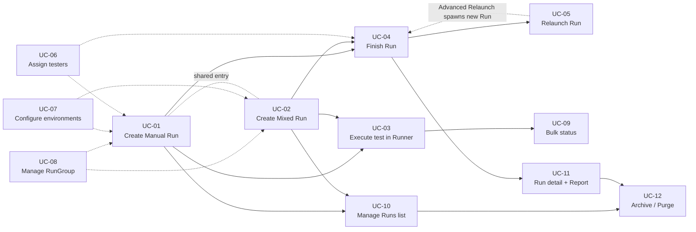

# Use Cases — Index

Use Cases (UCs) describe **actor-driven, goal-oriented flows** over Manual Tests Execution. Each UC cites the ACs it covers and the [Business Rules](../07-business-rules.md) it relies on. A traceability matrix ([_generated/traceability-matrix.md](../_generated/traceability-matrix.md)) links each UC's cited ACs to the manual tests that exercise them.

## Phase status

| Phase | UCs drafted |
|---|---|
| **Phase 1 (pilot)** | UC-01, UC-02 |
| **Phase 2 (scale — drafted)** | UC-03 through UC-12 |

## UC catalogue

| UC | Title | Primary actor | Sub-feature owner | Status |
|---|---|---|---|---|
| [UC-01](./UC-01-create-manual-run.md) | Create a Manual Run | QA Creator | run-creation | draft |
| [UC-02](./UC-02-create-mixed-run.md) | Create a Mixed Run | QA Creator | run-creation | draft |
| [UC-03](./UC-03-execute-test-in-runner.md) | Execute a test in the Manual Runner | Tester | test-execution-runner | draft |
| [UC-04](./UC-04-finish-run.md) | Finish a Run | QA Creator / Tester | run-lifecycle | draft |
| [UC-05](./UC-05-relaunch-run.md) | Relaunch a Run (Basic / Failed-on-CI / All-on-CI / Manually / Launch a Copy / Advanced) | QA Creator | run-lifecycle | draft |
| [UC-06](./UC-06-assign-testers.md) | Assign testers (single + Auto-Assign + bulk) | QA Creator | tester-assignment | draft |
| [UC-07](./UC-07-configure-environments.md) | Configure environments (One Run / Launch-in-Sequence / Launch-All) | QA Creator | environment-configuration | draft |
| [UC-08](./UC-08-manage-rungroup.md) | Create and manage a RunGroup (CRUD + Pin + Copy + Combined Report) | QA Creator | run-groups | draft |
| [UC-09](./UC-09-bulk-status-in-runner.md) | Apply bulk status in the Manual Runner | Tester | bulk-status-actions | draft |
| [UC-10](./UC-10-manage-runs-list.md) | Manage the Runs list (filter / multi-select / TQL / Custom view / URL share) | QA Creator | runs-list-management | draft |
| [UC-11](./UC-11-view-run-report.md) | View a Run detail & Report (Basic + Extended + Share + Compare + Export) | QA Creator | run-detail-and-report | draft |
| [UC-12](./UC-12-archive-unarchive-purge.md) | Archive, unarchive, purge (run + group + retention) | QA Creator | archive-and-purge | draft |

## Dependency graph

Arrows read as **"produces state consumed by"**. A dashed arrow is a *shared-surface* link (different UCs reach the same dropdown / dialog / mode), not a state dependency.

### How to read it

- **Solid arrows** encode the happy-path run lifecycle: *Create* → *Execute* → *Finish* → *Report / Relaunch / Archive*.
- **Dashed arrows** call out cross-surface reuse — e.g., UC-08 can be reached *from within* UC-01's arrow dropdown (it's not a prerequisite, just a shared entry point).
- **UC-09** (bulk status) is a variant of UC-03 in Multi-Select mode — shown as a child of UC-03.
- **UC-12** (archive/purge) is reachable from both UC-10 (Runs list extra menu) and UC-11 (Report extra menu) and from the RunGroup page (UC-08).

## Cross-cutting concerns → UCs

Map from the eight cross-cutting concerns in [destructuring.md § Cross-cutting concerns](../../../test-cases/manual-tests-execution/destructuring.md#cross-cutting-concerns) to the UCs that must cover them:

| Concern | Owning UC | Must also appear in |
|---|---|---|
| **A. Multi-environment** | UC-07 | UC-01 / UC-02 (creation), UC-04 (Finish across groups), UC-10 (list rendering), UC-11 (report breakdown) |
| **B. Multi-user assignment** | UC-06 | UC-03 (per-test assignee in Runner), UC-11 (assignee filter/grouping) |
| **C. RunGroup membership** | UC-08 | UC-01 / UC-02 (creation), UC-10 (Groups tab + Move), UC-12 (archive cascade) |
| **D. Run as checklist** | UC-01 | UC-03 (description-hidden runner UX) |
| **E. Custom statuses** | UC-03 | UC-10 (TQL `has_custom_status`), UC-11 (custom-status filter) |
| **F. Filter-applied scope** | UC-09 (bulk in runner) | UC-05 (Advanced Relaunch), UC-03 (single-test scope) |
| **G. Ongoing vs Finished state** | UC-04 | UC-05 (Continue vs Finish gated), UC-12 (archive behaviour differs) |
| **H. Bulk multi-select mode** | UC-09 (runner) + UC-10 (list) | UC-06 (bulk assign to tests) |

## Conventions

- File naming: `UC-NN-short-verb-object.md`.
- Each UC uses [`templates/use-case-template.md`](../templates/use-case-template.md).
- The trailing `## Verifying tests` block is generated by `scripts/gen-traceability.ts` — see [_generated/traceability-matrix.md](../_generated/traceability-matrix.md).
