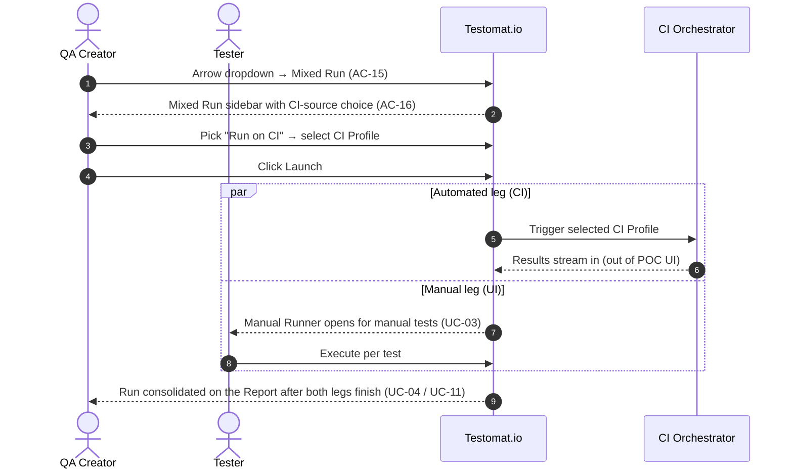

# 09 — Process Flows

Sequence diagrams for the three load-bearing end-to-end journeys plus two notable variants. Each diagram names only the user-visible surfaces — internal API calls are abstracted as `System`. State transitions are cited to [05-state-diagrams.md](./05-state-diagrams.md) and the relevant UCs.

> **Reading key.** `QA` = QA Creator; `T` = Tester; `Sys` = Testomat.io app (UI + backend collapsed). `CI` = external CI orchestrator. `UI` tags mark user-visible feedback (dialogs, toasts, URL changes) that the flow must preserve.

---

## Flow A: Launch → Execute → Finish → Report → Relaunch

Canonical happy path for a Manual Run. References [UC-01](./06-use-cases/UC-01-create-manual-run.md) → [UC-03](./06-use-cases/UC-03-execute-test-in-runner.md) → [UC-04](./06-use-cases/UC-04-finish-run.md) → [UC-11](./06-use-cases/UC-11-view-run-report.md) → [UC-05](./06-use-cases/UC-05-relaunch-run.md).

```mermaid
sequenceDiagram
    autonumber
    actor QA as QA Creator
    actor T as Tester
    participant Sys as Testomat.io

    QA->>Sys: Open Runs page, click Manual Run (left)
    Sys-->>QA: New Manual Run sidebar opens (AC-1, ac-delta-1)
    QA->>Sys: Fill Title / RunGroup / Env / Scope; click Launch
    Note over Sys: Validate Require-RunGroup (BR-1)
    Sys-->>QA: Run transitions to In-Progress; Manual Runner opens on first test (AC-23)

    rect rgb(245,245,245)
        Note over T,Sys: Execution loop (UC-03)
        T->>Sys: Select test; optionally enter Result message
        T->>Sys: Click PASSED / FAILED / SKIPPED
        Sys-->>T: Counter increments; tree row icon updates (AC-29, AC-30, AC-95)
        T->>Sys: (Optional) attach file, set Custom Status (BR-5), add notes
        T->>Sys: ↓ or click next test
    end

    QA->>Sys: Click Finish Run in runner header
    Sys-->>QA: Confirmation dialog — announces Pending→Skipped count (AC-28, ac-delta-9)
    QA->>Sys: Confirm
    Note over Sys: Pending → Skipped (BR-7); Run → Finished (AC-25/26)
    Sys-->>QA: Navigate to Run Report (UC-11)

    QA->>Sys: Inspect Basic → Extended → Export PDF
    Sys-->>QA: Report rendered; artefacts produced (AC-82..AC-88)

    QA->>Sys: Open Relaunch ▾ → Relaunch Manually
    Sys-->>QA: Same Run reopens In-Progress; tests reset to Pending (AC-61)
```

### Invariants
- **Launch is atomic** — either the Run exists (and the Runner opens) or it doesn't; partial creation is not observable to the user (ac-delta-18 of run-creation).
- **Finish is terminal + confirmable** — cancelling the dialog is a no-op ([BR-7](./07-business-rules.md#br-7), ac-delta-10 of run-lifecycle).
- **Relaunch ▾ is gated on Finished** — not exposed on In-Progress / Pending / Terminated (ac-delta-8 of run-lifecycle).

---

## Flow B: Archive cascade on a RunGroup

References [UC-08](./06-use-cases/UC-08-manage-rungroup.md) + [UC-12](./06-use-cases/UC-12-archive-unarchive-purge.md), enforced by [BR-9](./07-business-rules.md#br-9) and (for ongoing children) [BR-8](./07-business-rules.md#br-8).

```mermaid
sequenceDiagram
    autonumber
    actor QA as QA Creator
    participant Sys as Testomat.io

    QA->>Sys: Runs page → Groups tab → RunGroup extra ⋯ → Archive
    Sys-->>QA: Confirmation dialog (cascade wording)
    QA->>Sys: Confirm

    rect rgb(245,245,245)
        Note over Sys: Cascade — all nested Runs (BR-9)
        loop each nested Run
            alt Run state = Finished
                Sys->>Sys: Apply "Archived" badge, move to Archive
            else Run state = In-Progress / Pending
                Sys->>Sys: Transition to Terminated (BR-8), Pending→Skipped (AC-76)
                Sys->>Sys: Apply "Terminated" badge, move to Archive
            end
        end
    end

    Sys-->>QA: Group disappears from active Runs list; Groups Archive link count +1
    Sys-->>QA: Toast / confirmation banner (UI)

    Note over QA,Sys: Reverse path — Groups Archive → extra ⋯ → Unarchive restores group + all children (ac-delta-15)
```

### Invariants
- **Atomic cascade** — no observable intermediate state where group is archived but children aren't (or vice versa) — [BR-9](./07-business-rules.md#br-9).
- **Unarchive preserves prior status** — Terminated stays Terminated (cannot resume — [BR-8](./07-business-rules.md#br-8)); Finished stays Finished; Archived stays Archived.
- **Runs-only bulk** — Multi-Select on the Runs list does not target RunGroups for archive (ac-delta-2 of archive-and-purge).

---

## Flow C: Multi-Environment Launch in Sequence

References [UC-07](./06-use-cases/UC-07-configure-environments.md) A1 (Launch in Sequence). Cross-cutting concern A ownership.

```mermaid
sequenceDiagram
    autonumber
    actor QA as QA Creator
    participant Sys as Testomat.io

    QA->>Sys: Click "+" on Environment section (New Manual Run)
    Sys-->>QA: Multi-Environment Configuration modal opens (ac-delta-1)
    QA->>Sys: Configure group #1 (e.g. Browser:Chrome)
    QA->>Sys: Click "Add Environment" → configure group #2 (e.g. Browser:Firefox)
    QA->>Sys: Click Save
    Note over Sys: 2+ groups — Launch replaced by "Launch in Sequence" + "Launch All" (ac-delta-7)

    QA->>Sys: Click "Launch in Sequence" (AC-49)
    Note over Sys: Create parent RunGroup + one child Run per env group

    rect rgb(245,245,245)
        Note over Sys: Sequential execution
        Sys->>Sys: Child #1 → In-Progress, runner active
        Sys-->>QA: Runs list shows parent group expanded, only child #1 active
        Note over Sys: Child #1 finished via UC-04
        Sys->>Sys: Child #2 → In-Progress (activates only now, ac-delta-9)
        Note over Sys: Child #2 finished via UC-04
    end

    Sys-->>QA: Parent RunGroup consolidated; Report + Combined Report available (UC-08 A4)
```

### Invariants
- **Only one child active at a time** (Sequence) — ac-delta-9 of environment-configuration.
- **Each env badge renders per child** — ac-delta-11 of environment-configuration; rendered by [UC-10](./06-use-cases/UC-10-manage-runs-list.md).
- **Launch All** is the parallel variant — all children transition to In-Progress simultaneously (ac-delta-10). `Launch All` with *Without tests* scope is blocked with a non-modal banner *"Select a plan or select all"* (ac-delta-12).

---

## Flow D: Mixed Run launch with CI Profile

References [UC-02](./06-use-cases/UC-02-create-mixed-run.md) main flow. [BR-3](./07-business-rules.md#br-3).



### Invariants
- **No CI, no automated execution** — Mixed Run launched without a CI Profile or local CLI (A1) leaves the automated portion orphaned ([BR-3](./07-business-rules.md#br-3)). Exact UI enforcement is **UNCLEAR** ([OQ-02](./13-open-questions.md#oq-02)).
- **Legs are independent** — the manual leg can finish before or after the automated leg.

---

## Flow E: Bulk status in Runner (filter-aware)

References [UC-09](./06-use-cases/UC-09-bulk-status-in-runner.md). Cross-cutting concerns F + H.

```mermaid
sequenceDiagram
    autonumber
    actor T as Tester
    participant Sys as Testomat.io

    T->>Sys: Toggle Multi-Select in runner header (ac-delta-1)
    Note over Sys: Checkboxes appear, bulk toolbar is NOT yet rendered (ac-delta-5)
    T->>Sys: Apply Priority filter "High" (ac-delta-17)
    T->>Sys: Click "Select all" (ac-delta-3)
    Note over Sys: Selects visible (= filter-matching) tests only (AC-66)
    Sys-->>T: Bottom bulk-action toolbar renders with selection counter (ac-delta-4)

    T->>Sys: Click Result message → pick FAILED → type message → Apply (AC-94)
    Note over Sys: Apply disabled until a standard status is picked (ac-delta-6, BR-5)
    Sys-->>T: Every selected test gets FAILED + message; modal closes silently (ac-delta-8)
    Sys-->>T: Header counters update immediately (AC-95, ac-delta-9)

    Note over T,Sys: Cancel path — dismissing the modal clears selection (ac-delta-7)
    Note over T,Sys: × Clear-Selection keeps Multi-Select ON, clears selection only (ac-delta-11)
```

### Invariants
- **Zero selection, no toolbar** — ac-delta-5 of bulk-status-actions. No empty-state bulk affordance.
- **Filter-aware Select-all** — [UC-05 A8](./06-use-cases/UC-05-relaunch-run.md#a8-advanced-relaunch-with-a-filter-applied-selection-scope) mirrors this for Advanced Relaunch.
- **Dismiss-as-cancel** — closing the Result message modal without Apply clears selection (ac-delta-7).

---

## State-transition quick-reference

| From | Event | To | Source |
|---|---|---|---|
| Pending | Continue (first entry) | In-Progress | AC-24, ac-delta-7 of run-lifecycle |
| In-Progress | Finish Run (confirmed) | Finished | AC-25, [BR-7](./07-business-rules.md#br-7) |
| In-Progress | Archive (ongoing) | Terminated | AC-76, [BR-8](./07-business-rules.md#br-8) |
| Finished | Relaunch (in-place) | In-Progress (same Run ID) | AC-58 |
| Finished | Advanced Relaunch (Create-new-run ON) | In-Progress (new Run ID) | AC-63 |
| Finished | Archive | Archived (state preserved) | AC-75 |
| Any (Archive only) | Unarchive | prior state (Terminated stays Terminated) | [BR-8](./07-business-rules.md#br-8), AC-80 |
| Finished / Archived | Purge | Archived + "Purged" badge | AC-78, [BR-12](./07-business-rules.md#br-12) |
| Archived | Permanent delete | (gone) + Pulse "Deleted Run" | AC-81, ac-delta-18 of archive |

> Full state diagrams: [05-state-diagrams.md](./05-state-diagrams.md).
