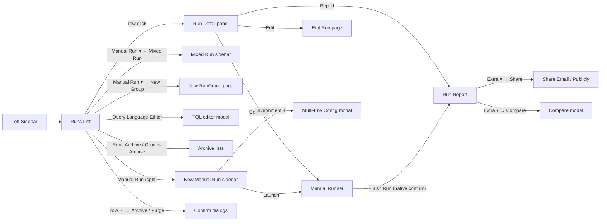

# 10 — UI Catalog (Surface Map)

A navigation + purpose map of every user-visible surface involved in a Manual Run's lifecycle. This is a BA-level distillation: what each surface **exists to do**, how users **arrive there**, which **sub-features** own it, and which **UCs / BRs** it enforces. For low-level element inventories, selectors, and DOM structure see [`_shared-ui.md`](../../../test-cases/manual-tests-execution/_shared-ui.md).

> **Reading key.** *Owned by* = the sub-feature(s) whose acceptance criteria primarily govern the surface. *Enforces* = business rules whose validation is user-visible here. Surfaces are grouped by task phase (Plan → Launch → Execute → Finish → Report → Archive).

---

## 0. Orientation — navigation map

---

## 1. Persistent chrome

### 1.1 Left sidebar navigation

- **Purpose.** Global project navigation (Tests, Requirements, **Runs**, Plans, Steps, Pulse, Imports, Analytics, Branches, Settings, Help, Profile).
- **Arrival.** Present on every project page.
- **Relevance for this feature.** `Runs (Shift+3)` is the single entry point into the Manual Run flow; `Pulse (Shift+6)` surfaces the *"Deleted Run"* audit event (AC-81).
- **Owned by.** Out of scope (shared app chrome) — referenced only.

### 1.2 Breadcrumbs (Runs context)

- **Purpose.** Anchor the user inside the Runs area: `Project / Runs (count)`.
- **Count badge.** Total **non-archived** runs (includes ongoing, finished, terminated).
- **Owned by.** runs-list-management.

---

## 2. Runs List (primary hub)

**URL:** `/projects/{project}/runs/`

- **Purpose.** The project-wide inventory of Manual / Automated / Mixed runs and RunGroups. Acts as launch pad (split button), triage surface (filters + chart), and governance surface (Multi-Select, TQL, Archive footer).
- **Arrival.** Left sidebar → Runs; or from any Run Report → `Run #{id}` breadcrumb.
- **Primary affordances.**
  - **Filter tabs** — `Manual | Automated | Mixed | Unfinished | Groups` (swaps the active row set).
  - **Split-button `Manual Run`** — primary click launches [UC-01](./06-use-cases/UC-01-create-manual-run.md); chevron expands to `New Group`, `Report Automated Tests`, `Launch from CLI`, `Mixed Run` ([UC-02](./06-use-cases/UC-02-create-mixed-run.md)).
  - **Runs Status Report (AI)** — disabled unless ≥ 5 finished runs (ac-delta-4 of runs-list-management).
  - **Multi-Select** — toggles row checkboxes and enables a floating bulk toolbar; RunGroups are **not** targeted (ac-delta-2 of archive-and-purge).
  - **Query Language Editor** — opens the TQL modal (ac-delta-15).
  - **Custom view / Default view toggle** — swaps card list ↔ table; column set differs (see `_shared-ui.md` § Runs List).
  - **Chart area** — per-day stacked Passed / Failed / Skipped totals; legend is a clickable filter; `Hide chart / Show chart` toggle.
  - **Pagination** — first / last arrows; current page is plain text.
  - **Row extra menu (⋯)** — state-aware: Relaunch / Advanced Relaunch / Launch a Copy / Pin / Export as PDF / Move / Labels / Move to Archive / Purge. Relaunch entries are gated on Finished; Move cannot target the run's own group.
  - **Footer Archive links** — Runs Archive + Groups Archive with live counts (ac-delta-17 of runs-list-management).
- **Owned by.** runs-list-management (rows) + archive-and-purge (footer) + run-lifecycle (status indicators) + run-groups (Groups tab).
- **Enforces.** [BR-9](./07-business-rules.md#br-9) (cascade badges on archived groups), [BR-11](./07-business-rules.md#br-11) (archived filter behavior).

---

## 3. Launch surfaces

### 3.1 New Manual Run sidebar

**URL:** `/projects/{project}/runs/new` (right-side drawer)

- **Purpose.** Single form that collects Title / RunGroup / Environment / Description / Scope / Checklist toggle and launches a Manual Run.
- **Arrival.** Runs list → left half of the `Manual Run` split button.
- **Key affordances.**
  - **Assignee chip + `Assign more users`** — opens the tester-assignment subflow ([UC-06](./06-use-cases/UC-06-assign-testers.md)).
  - **RunGroup selector** — `Without rungroup` + named groups; required if [BR-1](./07-business-rules.md#br-1) is active at project scope.
  - **Environment multi-select** — clicking opens the Multi-Env Config modal (§ 3.2).
  - **Scope tabs** — `All tests` | `Test plan` | `Select tests` | `Without tests` ([BR-2](./07-business-rules.md#br-2), BR-4).
  - **Run as checklist** — hides descriptions; [UC-03 A5](./06-use-cases/UC-03-execute-test-in-runner.md#a5-run-as-checklist).
  - **Run Automated as Manual** — promotes automated-tagged tests into the manual runner.
  - **Launch / Save / Cancel** — Launch opens the runner; Save parks the Run as Pending (AC-24).
- **Owned by.** run-creation (+ environment-configuration, tester-assignment cross-cutting).
- **Enforces.** BR-1, BR-2, BR-4, BR-6.

### 3.2 Multi-Environment Configuration modal

**URL:** modal over `/runs/new` (and Edit Run)

- **Purpose.** Build one or more **environment groups** (e.g. Windows+Chrome, Linux+Firefox) that each materialize as a child Run on Launch in Sequence / Launch All.
- **Affordances.** Numbered slots • environment checklist (OS + Browser) • `Add Environment` • `Add all envs` • `Save` / `Cancel`.
- **Launch-button morphism.** At ≥ 2 groups, the parent "Launch" button **splits** into `Launch in Sequence` + `Launch All` (ac-delta-7 of environment-configuration).
- **Owned by.** environment-configuration.
- **Enforces.** ac-delta-12 (Launch All + Without-tests is blocked with non-modal banner).

### 3.3 Mixed Run sidebar

Same shell as § 3.1 with an additional **CI-source picker** (Run on CI / CLI / None) — see [UC-02](./06-use-cases/UC-02-create-mixed-run.md).

### 3.4 Query Language Editor modal

- **Purpose.** Build TQL expressions that drive the Runs list view and can be saved as named queries.
- **Affordances.** Monaco-like editor with autocomplete toggle • Saved Queries + Examples tabs • Operators sidebar (`and`, `or`, `not`, comparators, `in [...]`, `%`) • Variables sidebar (title, plan, rungroup, env, tag, label, jira, durations, counts, status flags, dates…) • `Apply` / `Save` / `Cancel` • `Read Docs` external link.
- **Owned by.** runs-list-management (ac-delta-15).

---

## 4. Execution surface

### 4.1 Manual Runner

**URL:** `/projects/{project}/runs/launch/{id}/?entry={testId}`

- **Purpose.** The single-tester execution surface — one test at a time, navigable via tree + hotkeys, marking PASSED / FAILED / SKIPPED with optional message, attachment, and notes.
- **Arrival.** Launch click from § 3.1, or **Continue** from Run Detail panel (AC-24).
- **Regions.**
  - **Header** — back-to-runs link • `N/M tests (X% completed)` • Fast Forward (tooltip) • Auto-Track (tooltip) • Create notes • **Finish Run** (primary). Fast Forward behaviour is **UNCLEAR** (AC-97 / [OQ-11](./13-open-questions.md#oq-11)).
  - **Status counter bar** — Passed / Failed / Skipped / Pending; clicking a counter filters the tree (AC-95).
  - **Filter toolbar** — Priority (`Normal | Low | High | Important | Critical`) + Multi-Select toggle + Collapse-all.
  - **Tree panel** — suites + tests; each suite has `Add note to suite` + `Add test to suite`.
  - **Execution panel** — Test title + breadcrumb • Result section (hotkey hint + PASSED / FAILED / SKIPPED full-width buttons) • Result message textarea • attachment slot • Edit metafields expandable.
  - **Bulk toolbar** (appears only when a selection exists under Multi-Select — ac-delta-5 of bulk-status-actions) — Status • Result message • Assign tester • × Clear-selection.
- **Hotkeys.** PASSED = `Cmd+Enter`, FAILED = `Cmd+U`, SKIPPED = `Cmd+I`.
- **Owned by.** test-execution-runner (+ bulk-status-actions for Multi-Select).
- **Enforces.** [BR-5](./07-business-rules.md#br-5) (custom statuses require a standard status), BR-7 (Pending → Skipped at Finish).

### 4.2 Finish Run confirmation (native `confirm` dialog)

- **Purpose.** Irreversible gate before flipping the Run to Finished — announces the Pending → Skipped count verbatim (ac-delta-9 of run-lifecycle).
- **Trigger.** `Finish Run` button in § 4.1.
- **Outcome.** Confirm → Run transitions to Finished (AC-25) and navigates to § 5.2; Cancel → no-op.
- **Owned by.** run-lifecycle. Enforces [BR-7](./07-business-rules.md#br-7).

---

## 5. Review & reporting surfaces

### 5.1 Run Detail panel (right-side drawer on Runs list)

**URL:** `/projects/{project}/runs/{id}/`

- **Purpose.** Mid-flow inspection without leaving the Runs list. Surfaces run identity, summary metrics, and entry points to the Runner and the Report.
- **Header.** Copy Settings • Run Summary AI button (disabled when ongoing) • `Report` link • Edit • Close.
- **Body.** Doughnut chart • Status / Duration / Tests / Plan / Executed / Executed by / Created by / Set labels.
- **Tabs.** Tests (default), Statistics, Defects.
- **Test sub-panel** (when a row is clicked). Tabs: Summary | Description | Code template | Runs.
- **Owned by.** run-detail-and-report.

### 5.2 Run Report page

**URL:** `/projects/{project}/runs/{id}/report/`

- **Purpose.** Read-only post-execution view optimised for triage, sharing, and archival. Supports both Basic and Extended layouts.
- **Header affordances.** Run title + status ● • **Copy Link** (AC-99 behavior is **UNCLEAR**, [OQ-20](./13-open-questions.md#oq-20)) • Extra ▾ menu (Download XLSX, Export PDF, Share Email, Share Publicly, Compare, Custom Report view — see UC-11).
- **Filter toolbar.** Pass / Fail / Skip counters + search + Tree View toggle.
- **Summary panel.** Run metadata + Overview tabs: Suites | Tags | Labels | Assignees | Priorities (Suites tab has Folders toggle + sort by name/failed).
- **Test sub-panel.** Mirrors § 5.1's sub-panel.
- **Related dialogs.**
  - **Share Email dialog** — recipient list + message; governed by BR-13.
  - **Share Publicly dialog** — defaults: **7-day expiry + passcode ON** (ac-delta-19 of run-detail-and-report).
  - **Compare matrix modal** — ac-delta-21.
  - **AI Run Summary** — disabled mid-run (same affordance as § 5.1).
- **Owned by.** run-detail-and-report.
- **Enforces.** [BR-13](./07-business-rules.md#br-13).

### 5.3 Edit Run page (full form)

**URL:** `/projects/{project}/runs/edit/{id}/`

- **Purpose.** Structural mutation of an existing (non-finished) Run — Title / Assigned users / Environment / Description / Tests scope.
- **Arrival.** Run Detail panel → Edit; or row extra menu.
- **Constraints.** Editing a Finished Run is blocked (BR-10); testers cannot reach this view (BR-6).
- **Owned by.** run-creation (edit path) + tester-assignment.

---

## 6. RunGroup surfaces

### 6.1 New RunGroup page

- **Purpose.** Create a parent RunGroup with a title, optional description, plan binding, and ordering hints.
- **Arrival.** Runs list → split-button ▾ → `New Group`; or from inside Groups tab.
- **Owned by.** run-groups. Enforces [BR-1](./07-business-rules.md#br-1) (if the project requires RunGroup on Runs).

### 6.2 RunGroup detail page

**URL:** `/projects/{project}/runs/groups/{id}`

- **Purpose.** Browse child runs, consolidate results, and manage membership.
- **Key affordances.** Add Manual Run in-group • Move existing runs in/out • Add Existing Run • Pin / Unpin • Edit • Copy Group (with toggles) • Archive (cascade) • Purge (20 k ceiling, [OQ-17](./13-open-questions.md#oq-17)) • **Combined Report** link.
- **Extra menu (⋯).** Copy / Pin / Edit / Add Existing Run / Archive / Purge (ac-delta-12 of run-groups).
- **Owned by.** run-groups.
- **Enforces.** BR-9 (cascade), [BR-10](./07-business-rules.md#br-10) (Combined Report composition), [BR-12](./07-business-rules.md#br-12) (Purge behavior).

### 6.3 Groups tab on the Runs list

- **Purpose.** Filter the Runs list to just RunGroup rows; each row expands to show child runs (ac-delta-9 of environment-configuration — sequential activation visible here).
- **Owned by.** runs-list-management + run-groups.

---

## 7. Archive surfaces

### 7.1 Runs Archive

**URL:** `/projects/{project}/runs/archive/`

- **Purpose.** Read-only list of archived Runs (Archived / Purged / Terminated). Distinct badges per state (ac-delta-16 of archive-and-purge).
- **Affordances.** Filter tabs (mirrors main list) • Search • Sort • Row extra menu now exposes **Unarchive**, **Purge** (if Archived), **Permanent delete** (if Purged, gated by Admin — [OQ-13](./13-open-questions.md#oq-13)).
- **Owned by.** archive-and-purge.
- **Enforces.** BR-8 (Terminated is terminal — Unarchive preserves state), BR-11, BR-12.

### 7.2 Groups Archive

**URL:** `/projects/{project}/runs/group-archive/`

- **Purpose.** Parallel archive for RunGroups; Unarchive restores the group **and** all children, each child retaining its prior state (ac-delta-15 of run-groups).

### 7.3 Confirmation dialogs (archive / purge / unarchive / delete)

- **Purpose.** Irreversible-action gating with copy that names the cascade when applicable.
- **Ownership.** archive-and-purge. Specific copy and button wording: see `_shared-ui.md` + UC-12.

### 7.4 Pulse "Deleted Run" event

- **Purpose.** Post-deletion audit trail in the Pulse feed — the only visible evidence once a Run is permanently deleted (AC-81, ac-delta-18).
- **Ownership.** archive-and-purge (surface) + external (Pulse feature).

---

## 8. Cross-cutting UI patterns

| Pattern | Where it appears | Intent |
|---|---|---|
| **Split primary button** | Manual Run (Runs list), Launch (Multi-env modal at 2+ groups) | Offer a safe default + advanced variants. |
| **Native browser `confirm`** | Finish Run, quick-set bulk status (ac-delta-10 of bulk-status-actions) | Browser-level irreversibility gate. |
| **App modal confirm** | Archive / Purge / Unarchive / Permanent delete | In-app confirmation with cascade copy. |
| **Row extra menu (⋯)** | Runs list, Groups tab, RunGroup detail | State-aware action surface — items show/hide with state. |
| **Toast** | After Save / Archive / Purge / Pin | Non-blocking success feedback. |
| **Non-modal banner** | Launch All + Without-tests ("Select a plan or select all") | Soft blocker inside a modal. |
| **Status ● circles** | Everywhere — list, runner, report | Single visual vocabulary (green / red / gray / orange / blue). |
| **Hotkey hint line** | Runner execution panel | Discoverability for Cmd+Enter / Cmd+U / Cmd+I. |
| **Badge slots** | List rows (Archived / Purged / Terminated), run type (manual/mixed/automated), env chips | Multi-dimensional state at a glance. |

---

## 9. URL contract (stable deep-links)

| URL | Surface | Primary UC |
|---|---|---|
| `/runs/` | Runs list | UC-10 |
| `/runs/new` | New Manual Run sidebar | UC-01 |
| `/runs/{id}/` | Run detail panel over list | UC-11 (preview) |
| `/runs/launch/{id}/?entry={testId}` | Manual Runner | UC-03 |
| `/runs/{id}/report/` | Run Report | UC-11 |
| `/runs/edit/{id}/` | Edit Run | UC-04 A2 / UC-06 A6 |
| `/runs/groups/new` | New RunGroup page | UC-08 |
| `/runs/groups/{id}` | RunGroup detail | UC-08 |
| `/runs/archive/` | Runs Archive | UC-12 |
| `/runs/group-archive/` | Groups Archive | UC-12 |

> **Shareability.** The Runs list URL preserves active filter/TQL state via query-params (UC-10 A6); the Run Report URL is the canonical share target (Copy Link / Share Email / Share Publicly).

---

## 10. Cross-reference

- **Business rules enforced at UI.** [BR-1](./07-business-rules.md#br-1), BR-2, BR-4, BR-5, BR-6, BR-7, BR-8, BR-9, BR-10, BR-11, BR-12, BR-13.
- **Use cases anchored to these surfaces.** UC-01..UC-12 — see [`06-use-cases/README.md`](./06-use-cases/README.md).
- **State transitions visualised.** [`05-state-diagrams.md`](./05-state-diagrams.md).
- **Process flows through these surfaces.** [`09-process-flows.md`](./09-process-flows.md).
- **Element-level inventory.** [`test-cases/manual-tests-execution/_shared-ui.md`](../../../test-cases/manual-tests-execution/_shared-ui.md).
