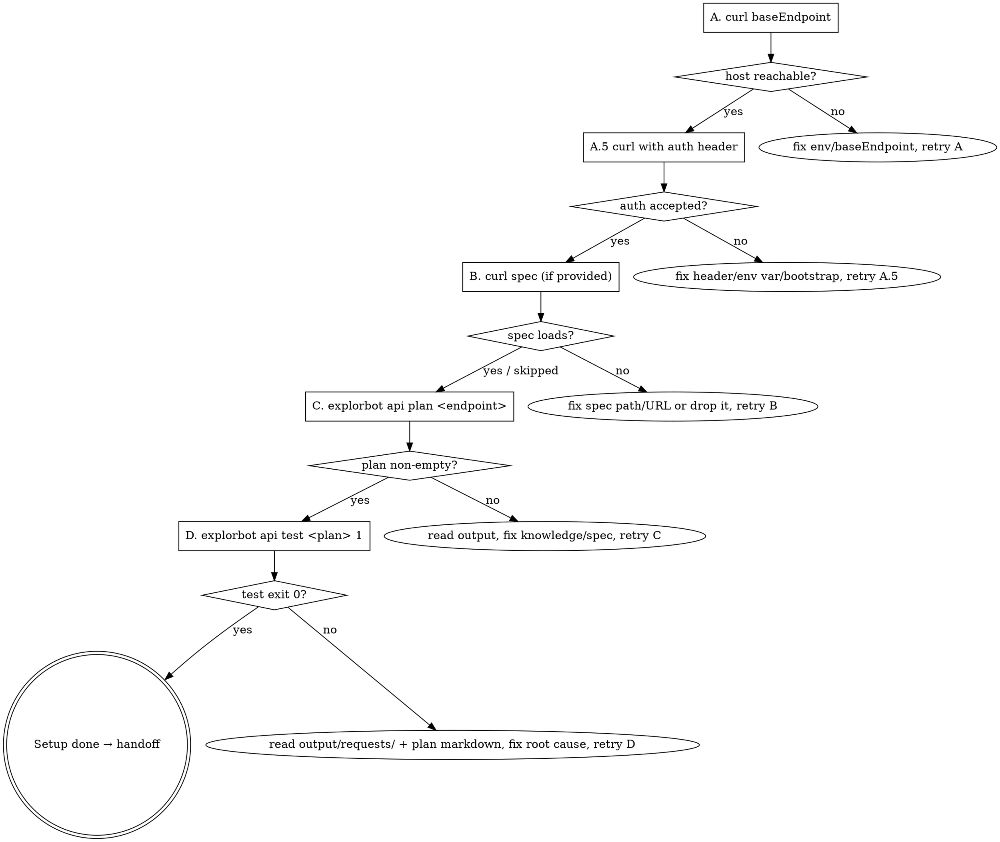

# Explorbot API Setup

Wire Explorbot's API testing module (the `explorbot api` subcommand) to the user's REST API, prove it can reach the API with the right auth, generate a test plan against one real endpoint, and run a single test from that plan to exit `0`.

**Scope ends at one successful `explorbot api test <plan> 1`.** Running full `explore`, multi-style planning, or writing extra knowledge files is not part of setup — once one test passes, hand off to [[explorbot-fundamentals]] (`docs/api-testing.md` topic).

**Do the work — don't narrate it.** Edit the config, write knowledge via `npx explorbot api know`, run `curl`, run `npx explorbot api plan`, run `npx explorbot api test`. The user is only asked for the things only they know:

1. **Base endpoint** — the URL prefix every request hits (e.g. `https://api.example.com/v1`)
2. **Auth** — header name + value, or a login flow if the token must be fetched at runtime
3. **OpenAPI spec** — URL or file path, if one exists (skip cleanly if not)
4. **One endpoint to verify against** — e.g. `/users`, `/posts`, `/runs`

Ask each one at the moment it's actually needed; do not pre-collect upfront.

## Communication style — friendly and explanatory

This is often the user's first contact with Explorbot's API mode. Before every ask and before every step, write 2–4 sentences covering **what** is about to happen, **why** it's needed, and **what the user gets**.

When asking a question, explain the choice itself — what each option means, what the trade-off is, why you recommend one. Don't make the user guess what a label means.

After every step, give a short progress note ("Plan generated — 8 tests. Next: I'll run test #1 and see if it exits 0.") so the user knows where they are.

## Precondition check — Explorbot must already be installed

API setup is **a layer on top of an existing Explorbot install**. Verify before doing anything else:

```bash
test -d node_modules/explorbot && echo "explorbot installed" || echo "missing"
```

If missing, **stop and route the user to [[explorbot-setup]]** — install Explorbot the proper way there (Node ≥ 24 or Bun, ESM `package.json`, `npx playwright install`, an AI provider + key in `.env`), then come back here. Do not try to install Explorbot from this skill.

Also confirm the `api` subcommand actually exists in the installed version:

```bash
npx explorbot api --help
```

You should see `plan`, `test`, `explore`, `init`, `know` subcommands. If `api` is not listed, the installed Explorbot is too old — tell the user to upgrade (`npm i explorbot@latest`) and re-run the check.

(For an Explorbot contributor working in the explorbot repo itself, the `bin/explorbot-cli.ts` already wires the `api` subcommand. Detect this by checking the project's `package.json` for `"name": "explorbot"` and use `bun bin/explorbot-cli.ts api …` in place of `npx explorbot api …`.)

## 1 — Pick the config mode

Explain first, in this spirit:

> "API testing can either share your existing `explorbot.config.js` (recommended for most projects — one config file, both web and API tests) or live in a dedicated `apibot.config.ts` (only worth it if this project will *only* test an API and never drive a browser). Both modes use the same `api:` config shape and the same CLI. Which fits this project?"

Default to **unified** (`explorbot.config.js`) unless the user explicitly says API-only.

If unified, **read the existing `explorbot.config.js`** — work from its current shape and only add an `api:` section. Do not rewrite the `web:` or `ai:` blocks. If you need to look at the unified config's reference shape, open `node_modules/explorbot/docs/api-testing.md` and `node_modules/explorbot/docs/configuration.md` — never paste from memory.

If standalone, run `npx explorbot api init` and let it write `apibot.config.ts`. The init command is interactive (asks for base endpoint, OpenAPI spec, free-text knowledge) — drive it yourself by collecting those answers from the user first.

## 2 — Collect the API contract

These three pieces of information define the entire `api:` block. Ask each at the moment you need it; do not pre-prompt.

### 2A — Base endpoint

Explain why:

> "Every request Explorbot makes is built as `<baseEndpoint><path>`. So `baseEndpoint: 'https://api.example.com/v1'` plus a planned step `GET /users` becomes `GET https://api.example.com/v1/users`. The path you give it must include any version prefix the API uses (`/v1`, `/api/v2/…`) — Explorbot won't add one for you."

Then look for evidence in the project first — `package.json` `scripts` for a `server` / `api` line, `.env` / `.env.example` for `API_URL` / `API_BASE_URL` / `BACKEND_URL`, OpenAPI spec files in the repo. If you find a concrete URL, surface it as a *suggestion with its source* ("Found `API_URL=http://localhost:4000/api` in `.env` — use that as `baseEndpoint`?"). If no evidence, ask plain text: *"What's the base URL of the API I should test? Include any version prefix it uses."*

Do not guess. Do not pre-fill with anything from this skill's metadata or from other projects.

### 2B — Auth

Explain what's at stake:

> "Almost every real API requires auth. Explorbot supports three shapes: (1) a fixed header you already have — `Authorization: Bearer <token>` or `X-API-Key: <key>`; (2) a header value pulled from an env var at runtime — best for tokens you rotate; (3) a `bootstrap` async function that runs *before tests*, calls a `/login` endpoint with credentials, and returns the auth header — best when the token has to be minted fresh each session. The bootstrap function gets the cleanest credential handling because no secret ever sits in a header literal."

Ask which shape applies, then collect the matching pieces:

- **Fixed header / env-var header** → ask the header name and tell the user to put the *value* into `.env` under a clear env-var name (`<APP>_API_KEY`, `<APP>_API_TOKEN`). Reference it in the config via `process.env.<NAME>` interpolation — never paste the literal value.
- **Bootstrap** → ask the login endpoint, the field names (`email`/`password`, `username`/`password`, `apiKey`, etc.), and the path to the token in the response (`token`, `data.token`, `access_token`). Write the function using `fetch`; pull credentials from `process.env.<NAME>`. The function returns an object that's merged into `headers` for every subsequent request.
- **No auth** → confirm explicitly. Public APIs exist; you don't want to invent auth where none is needed.

For the actual secret values, offer the same three options the `[[explorbot-setup]]` skill uses for the AI key — **recommend the editor route** (user edits `.env` themselves, then says "continue"; the secret never enters chat). Verify with `grep -q "^<KEY_NAME>=." .env` before continuing.

### 2C — OpenAPI spec (optional but very valuable)

Explain why:

> "If your API has an OpenAPI / Swagger spec, give Explorbot the URL or file path. It gets parsed once at startup and the planner pulls the exact schema for each endpoint when it generates tests — so test bodies, query params, and expected response shapes match the real contract instead of being guessed from the endpoint name. Without a spec, Explorbot still works (the planner improvises from the URL and your knowledge files) but the plans are weaker. Skip cleanly if there isn't one."

Look in the project first — `openapi.yaml`, `openapi.json`, `swagger.json`, `docs/openapi.*`, an `/openapi` or `/swagger.json` route on the base endpoint. If you find a candidate, surface it ("Found `docs/openapi.yaml` in the repo — use it as the spec?"). Else ask: *"Is there an OpenAPI spec URL or file? Press Enter to skip."*

The config accepts an **array** of strings — `spec: ['<url-or-path>']` — even when there's only one. Match that shape.

## 3 — Write the `api:` block

Unified mode — edit `explorbot.config.js`, adding (do not pre-fill missing values; collect them first from §2):

```javascript
api: {
  baseEndpoint: '<from §2A>',
  spec: ['<from §2C>'],              // omit the line entirely if user skipped
  headers: {
    'Authorization': `Bearer ${process.env.<KEY_NAME>}`,   // shape from §2B
    'Content-Type': 'application/json',
  },
  // bootstrap: async ({ headers, baseEndpoint }) => { … },  // only if §2B chose bootstrap
},
```

Standalone mode — let `npx explorbot api init` write `apibot.config.ts`, then edit the same three fields (`baseEndpoint`, `spec`, `headers`) in the generated file. Init creates an `output/` and `knowledge/` directory next to the config; leave those defaults alone.

Tell the user what you wrote ("Added `api.baseEndpoint: …`, `api.spec: [...]`, and `Authorization` header reading from `process.env.<KEY_NAME>`") before moving on.

## 4 — Add baseline knowledge

Explain why:

> "Knowledge files tell Explorbot domain things the OpenAPI spec doesn't — what the API is for, which fields are special (UUIDs vs auto-IDs), what roles can do what, which test data is safe to create. Even one short paragraph at the wildcard `*` endpoint helps the planner generate sensible scenarios on the first try."

Ask: *"Give me 1–3 sentences describing this API — what it does, anything non-obvious about IDs / roles / data lifecycles."* Then write it:

```bash
npx explorbot api know "*" "<the user's description>"
```

The `*` endpoint applies to all endpoints. Confirm by reading `knowledge/general.md` — it should have `endpoint: "*"` frontmatter and the description body.

If the user names a specific endpoint with quirks ("`/users` requires admin role for writes"), add a second targeted file:

```bash
npx explorbot api know /users "CRUD endpoint. Requires admin role for POST/PUT/DELETE. IDs are UUIDs."
```

Don't pad — short and factual beats long and speculative.

## 5 — Verify with the API ladder

Walk these rungs **in order**. Stop at the first failure, fix it, then resume. Do not skip ahead.



### A — `curl` the base endpoint (no auth)

Cheapest network check before involving Explorbot or burning AI calls.

```bash
curl -sS -o /dev/null -w "HTTP %{http_code} in %{time_total}s\n" <baseEndpoint>
```

Interpret:

- `000` → DNS / VPN / wrong host. Fix and retry A.
- `200` / `2xx` → host is up and serving the root. Continue to A.5.
- `401` / `403` → host is up but requires auth even at the root. **Skip straight to A.5** — that's the next rung anyway.
- `404` → root path returns nothing, but that's normal for many APIs (the prefix is reserved for nested routes). Continue to A.5.
- `5xx` → API itself is broken. Stop and report to the user.

### A.5 — `curl` an endpoint with the real auth header

This proves the header values actually reach the server in a form it accepts. Source the env var from `.env` so you don't rely on shell exports:

```bash
set -a && source .env && set +a
curl -sS -H "Authorization: Bearer $<KEY_NAME>" -w "\nHTTP %{http_code}\n" <baseEndpoint>/<one-endpoint-from-§2D>
```

If §2B uses a `bootstrap` function instead of a fixed header, **skip A.5** — bootstrap runs inside Explorbot's process and there's no equivalent curl. Go straight to B.

Interpret:

- `200` / `2xx` → auth works. Continue to B.
- `401` / `403` → header isn't being accepted. Common causes: wrong env var name in `.env`, wrong header name (the API expects `X-API-Key` not `Authorization`), token shape mismatch (`Bearer ` prefix missing or extra). Fix the config or `.env`, retry A.5.
- `404` → endpoint name is wrong. Ask the user for an endpoint that exists.

### B — `curl` the OpenAPI spec (only if §2C provided one)

```bash
curl -sS -o /dev/null -w "HTTP %{http_code}\n" <spec-url>
```

If the spec is a file path, `test -f <path>` instead. If it doesn't load, drop the `spec:` line from config rather than letting Explorbot fail at startup — the planner still works without it, just less sharply.

### C — Generate a plan against the real endpoint

This is the first AI call. It's relatively cheap (one planning prompt, no executions) and writes a markdown file to `output/plans/`. Pick a *read-heavy* endpoint for the first plan if possible (e.g. `GET /users`) — write-heavy endpoints generate scenarios that mutate data, and you don't want surprise rows on the first verification run.

```bash
npx explorbot api plan <one-endpoint-from-§2D>
```

Interpret:

- Exit `0` with a saved plan path printed → open the file (`output/plans/<endpoint>.md`), confirm it lists at least one scenario. Continue to D.
- Exit `0` but `No test scenarios generated` → the planner couldn't find enough context. If you skipped the OpenAPI spec, that's the likely cause — go back and add one if you can. Otherwise enrich the knowledge file (`npx explorbot api know <endpoint> "<extra context>"`) and retry.
- Exit `1` → read the printed error. Most failures here are config (wrong `baseEndpoint`, missing AI provider key, bad spec URL). Fix and retry — don't escalate to D until C exits `0`.

### D — Run exactly one test from the plan

The `index` argument supports `1` (single test), `1-3` (range), `1,3,5` (list), `*` (all). Use `1` for verification — one round-trip, one AI run, minimum cost. Recorded request/response pairs land in `output/requests/`.

```bash
npx explorbot api test output/plans/<endpoint>.md 1
```

Interpret:

- Exit `0`, "1 passed, 0 failed" → **setup is done. Go to step 6.**
- Exit `1`, test failed → open `output/requests/` for the recorded request/response and the plan markdown for the scenario. If the failure is a real API issue (the test correctly found a bug), say so and stop — surface the finding to the user. If the failure is a setup issue (auth lost mid-test, wrong baseEndpoint variant, spec mismatch), fix that and retry D. Do not loop `test` blindly.

## 6 — Handoff

When `explorbot api test <plan> 1` exits `0`, setup is complete. Wrap up, in this spirit:

> "🎉 API setup is done — `<endpoint>` planned and one test passed cleanly. Here's where you stand:
>
> - `<config file>` has the `api:` block wired (`baseEndpoint`, `headers`, `spec`).
> - Credentials live in `.env` (gitignored).
> - `knowledge/general.md` (and any per-endpoint files you added) seed the planner.
> - `output/plans/<endpoint>.md` is the plan; `output/requests/` has the recorded request/response from test #1.
>
> Common next moves:
> - Run **`npx explorbot api test output/plans/<endpoint>.md *`** to run every scenario in that plan.
> - Run **`npx explorbot api explore <endpoint>`** to cycle all four styles (`normal`, `curious`, `psycho`, `hacker`) and produce a much broader plan set. This is the most token-heavy command — start with one endpoint and look at the output before turning it loose on others.
> - Add knowledge for more endpoints with `npx explorbot api know <path> "<context>"`.
>
> The `explorbot-fundamentals` skill (topic file: `node_modules/explorbot/docs/api-testing.md`) covers everything beyond setup. Want me to hand off there?"

Do not run `explore` from this skill — its multi-style cycle is expensive and out of scope.

## Anti-patterns

- ❌ Printing the commands and waiting for the user to run them — this skill **does** the config edit, the curl ladder, the plan, and the single test itself. Only the four user-only inputs are deferred.
- ❌ Trying to install Explorbot from this skill — that's `[[explorbot-setup]]`'s job. If `node_modules/explorbot/` is missing, route there.
- ❌ Pasting the `api:` config block from memory without reading `node_modules/explorbot/docs/api-testing.md` first — the shape may have changed.
- ❌ Pre-filling base endpoint, header name, or spec URL with anything other than evidence found in *this project* (`.env`, `package.json`, repo files) — never use a URL from another project or from this skill's text.
- ❌ Pasting an auth token or API key into the config literal instead of `process.env.<KEY>` — secrets always go in `.env` (gitignored), referenced via interpolation.
- ❌ Skipping the curl rungs (A, A.5, B) and jumping to `plan` — curl catches auth/network/spec issues without burning an AI call.
- ❌ Running `explorbot api explore` to "verify" — `explore` cycles all four planning styles and runs every generated test. Setup verification is one `plan` + one `test 1`.
- ❌ Running `explorbot api test <plan> *` for verification — that runs every scenario; you only need one to prove the loop closes. Use `1`.
- ❌ Picking a write-heavy endpoint (e.g. `POST /users`) as the first verification target when a read-heavy one exists — the planner will generate scenarios that mutate real data on the first run. Default to a `GET` endpoint unless the user names a specific write endpoint.
- ❌ Padding `knowledge/*.md` with speculation, framework names, or invented field types — a short factual description of what the API is for is enough; the planner reads the OpenAPI spec for the schema.
- ❌ Looping `api test` after a failure without reading `output/requests/` and the plan markdown — the failure could be a real API bug worth surfacing, not a setup issue worth retrying.

## Related skills

- [[explorbot-setup]] — install Explorbot from scratch and verify it can reach the user's web app. Use this first when `node_modules/explorbot/` is missing.
- [[explorbot-fundamentals]] — everything beyond setup (running, configuring, troubleshooting); see `node_modules/explorbot/docs/api-testing.md` for the API-mode reference.
- [[explorbot-debug]] — diagnose a failed API session from `output/explorbot.log` + recorded requests.
