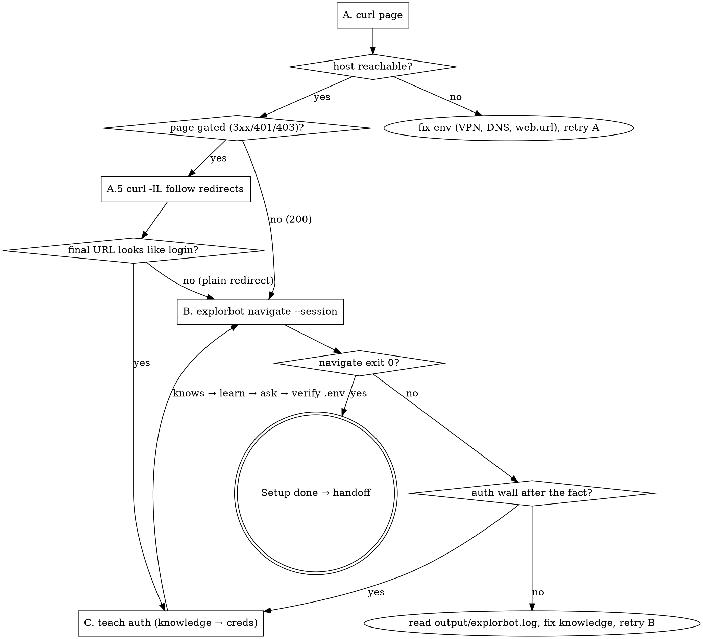

# Explorbot Setup

Install Explorbot, write a working config, give it the bare minimum knowledge to reach the user's app, and prove the install by getting `explorbot navigate <page>` to exit `0`.

**Scope ends at a successful `navigate`.** Running `explore`, `plan`, `test`, `freesail`, etc. is not part of setup — once navigate works, hand the user off to **`explorbot-fundamentals`**.

**Do the work — don't narrate it.** Run installs, run `explorbot init`, edit `explorbot.config.js`, run `curl`, run `explorbot navigate`, run `explorbot learn` yourself. The user is only asked for the things only they know:

1. AI provider + API key (OpenRouter / OpenAI / Anthropic / Groq / Cerebras / Azure / Google)
2. App URL (the value of `web.url`)
3. The page to verify against
4. Login credentials (only if `navigate` fails on an auth wall)

Don't pre-collect those four upfront — ask each one at the moment it's actually needed, and only ask for credentials at all if the ladder shows they're needed.

## Communication style — friendly and explanatory

This is the user's **first contact with Explorbot**. Most of them have never seen it before. Don't be terse, don't be transactional, and don't dump options without context.

**Before every ask and before every install step, write 2–4 sentences that cover:**

- **What** is about to happen ("I'm going to install Playwright's browsers — about 250MB, takes a couple of minutes.")
- **Why** it's needed ("Explorbot drives a real browser to click around your app like a user would — Playwright is the engine, the browsers are what it drives.")
- **What the user gets** from it ("Once this is done, Explorbot can navigate any URL on your app and try things autonomously.")

When asking a question, **explain the choice itself** — what each option means, what the trade-off is, why you recommend one. Don't make the user guess what a label means.

When showing a long command or a config snippet you're about to apply, say in one sentence what it does first.

After every step, give a short progress note ("Installed. Next: …") so the user knows where they are in a multi-step process. Use light formatting (a single emoji or `**Step N/6**` markers) only when it actually helps — never decorate for the sake of it.

Keep the tone warm and confident, not apologetic. Errors get a friendly explanation of what likely went wrong and what you'll try next, not a wall of stack trace.

## Precondition check

If `explorbot.config.{js,mjs,ts}` already exists (also check `config/`, `src/config/`) and the user is already running Explorbot, **stop and route them to `explorbot-fundamentals`** — this skill is for first-time install.

## 1 — Install

Verify Node ≥ 24 (or Bun) first; if neither is available, stop and tell the user — don't try to install a runtime.

**Make sure `package.json` exists and is ESM.** Explorbot's generated config uses `import …` statements, which need `"type": "module"`. The default `npm init -y` produces CommonJS — that breaks the config. If there's no `package.json` in the project, create one as ESM:

```bash
npm init -y
npm pkg set type=module
```

If `package.json` already exists but `"type"` is missing or set to `"commonjs"`, ask the user before changing it (could affect their existing code). If they consent, run `npm pkg set type=module`. If they don't, you'll need to write the explorbot config as `.mjs` instead and pass `--config-path explorbot.config.mjs` to every command.

Then install Explorbot and the browsers it drives:

```bash
npm i explorbot --save
npx playwright install
```

**Explain to the user before running these**, in this spirit (paraphrase, don't paste verbatim):

> "Two installs coming up. First, `npm i explorbot --save` pulls Explorbot into your project — the CLI you'll use to run everything later. Then `npx playwright install` downloads the Chromium / Firefox / WebKit browser binaries (~250MB, takes a minute or two). Explorbot drives a real browser to interact with your app the way a person would — clicks, forms, navigation — and Playwright is the engine that lets it do that. Without these browsers, Explorbot has nothing to drive."

If the user's app is a landing page, blog, or CMS, **stop and warn them** before installing — Explorbot is built for CRUD-heavy apps (SaaS, admin panels, ecommerce, ERPs, internal tools) and performs poorly on static / content sites. Explain *why* (it learns by interacting with forms, tables, CRUD actions — there's nothing for it to do on a marketing page). Continue only if they confirm.

## 2 — Initialize the config

Run:

```bash
npx explorbot init
```

This creates `explorbot.config.js` and `.env`. For flag options (`--config-path`, `--force`, `--path`), check `npx explorbot init --help`.

## 3 — Configure `web.url` and an AI provider

**Read the generated `explorbot.config.js`** — `explorbot init` writes a working template with placeholders. Work from that file's current shape; don't paste a config from memory.

Ask the user two things, then edit the file:

1. **App URL** — `web.url` (host only, no path).
2. **AI provider + API key** — which one (OpenRouter / OpenAI / Anthropic / Groq / Cerebras / Azure / Google) and the key value.

### How to ask for the URL — explain, then ask (no guessing)

The app under test is **the user's app** — could be a local dev server (`http://localhost:<port>`) or one of their hosted environments (staging / dev / production). **You cannot guess it.** Do not pre-fill URL options with "common defaults" and never with unrelated apps (`app.testomat.io`, `example.com`, anything from the skill's metadata).

Before asking, **explain why you need it** in this spirit:

> "Explorbot needs to know which web app to test. This is set as `web.url` in `explorbot.config.js` and becomes the base for every navigation — paths like `/login` or `/dashboard` will be resolved against it. It can be a local dev server (something running on `localhost`) or a hosted environment you own — staging or dev are usually safer than production, since Explorbot will click, fill, and submit forms autonomously and could create or change data."

Then:

1. **Look for evidence in the project first** — read `package.json` `scripts` for `dev` / `start` / `serve` lines, check `.env` / `.env.example` for `BASE_URL` / `APP_URL` / `NEXT_PUBLIC_*_URL` / `VITE_*_URL`, look at framework config (`next.config.*`, `vite.config.*`, `vue.config.*`) for a `port` setting. If you find a concrete URL or port, surface it as a *suggestion with its source* ("Found `PORT=4000` in `.env` — use `http://localhost:4000`?"). Never invent a URL without an actual source in the project.
2. **Optionally probe** ports the project implies — if `package.json` runs `next dev`, Next's default is 3000; check whether `http://localhost:3000` actually responds via `curl`. Only suggest a port that something is currently listening on, and say so ("Something is listening on `localhost:3000` — is that your app?").
3. **If no evidence** — ask in plain text: *"What's the URL of the app Explorbot should test? Local (e.g. `http://localhost:<port>`) or a hosted environment of yours (staging / dev / production — please avoid production if it'll create real data)?"* No multiple-choice list, no guesses.

Confirm what they answer back to them before writing it into the config.

### How to ask for the AI provider — explain first

Most users have never connected an LLM to a test tool before. Before asking, **explain what's happening and why**, in this spirit:

> "Explorbot is driven by an LLM — that's what looks at each page, decides what to click, fills forms intelligently, and judges whether a test passed. So Explorbot needs API access to a model, which means a token-based API key from a provider you have an account with. Costs are per-token (typically cents per exploration run), nothing fixed or monthly. The key stays local — written to `.env` in this project — and `.env` will be gitignored.
>
> Three providers I'd suggest, in order:
> - **OpenRouter** — easiest to start with. One account, one key, access to almost every model (OpenAI, Anthropic, Meta, Mistral, etc.) so you can swap models without re-onboarding. Good if you don't have a strong preference.
> - **OpenAI** — if you already have an OpenAI key, this is one less account.
> - **Anthropic** — if you already use Claude, same reason.
>
> Anything else that Vercel's AI SDK supports also works (Groq, Cerebras, Azure OpenAI, Google Gemini, etc.) — tell me which one and I'll wire it."

Then ask which one (and the API key value), and act on it:

- The template `explorbot init` generated already imports a provider; if the user picks a different one, swap the import line + the three `model:` / `visionModel:` / `agenticModel:` lines accordingly.
- The provider package follows the Vercel AI SDK convention: `@openrouter/ai-sdk-provider`, `@ai-sdk/openai`, `@ai-sdk/anthropic`, `@ai-sdk/groq`, `@ai-sdk/google`, `@ai-sdk/azure`, etc. `npm i` the matching one if it isn't already a dep — tell the user what you're installing and why.
- Reference the key in the config as `process.env.<KEY_NAME>` (e.g. `process.env.OPENROUTER_API_KEY`) and confirm `.env` is in `.gitignore`. If it isn't, **explain why you want to add it** ("so your key doesn't end up in git history") and add it.

### How to get the key into `.env` — offer three options, recommend the editor

The key itself never has to pass through the chat. Present these three options and **recommend option 1**:

1. **Edit `.env` yourself, then continue (recommended).** This is the most secure path — the key never goes through chat, never lands in transcripts or logs. Say to the user, in this spirit:

   > "I'd recommend the safest way: open `.env` in your editor, add the line `OPENROUTER_API_KEY=…` (paste the value there), save, then just tell me 'continue' or 'ready' and I'll pick up the verification step. The key never has to pass through this chat that way."

   When they confirm they've saved it, verify it's set before continuing:

   ```bash
   grep -q "^<KEY_NAME>=." .env && echo "key present" || echo "key missing"
   ```

   If "key missing", tell them and wait — don't proceed to step 5.

2. **Paste the key here and I'll write it.** Less secure (the key passes through chat), but convenient. Only use this if the user explicitly prefers it. When they paste, write it to `.env` immediately and do not echo the value back in your reply.

3. **Skip for now — I'll set it up later.** Legitimate, but be clear: setup will **stop at step 4**, no verification will run. They'll finish by editing `.env` themselves and then running `npx explorbot navigate <path> --session` manually. Recommend they come back through `explorbot-fundamentals` once the key is in place.

Do not list these in a `1/2/3` multiple-choice prompt where #1 looks just as casual as the others — call option 1 out as the recommended one in your explanation, and frame option 2 as the less-secure alternative.

(Once Explorbot is installed, the canonical reference for everything in this section is `node_modules/explorbot/docs/configuration.md` and `node_modules/explorbot/docs/providers.md`. The fundamentals skill uses these — setup shouldn't need them unless the generated template is unclear.)

## 4 — Pick the verification page

Before asking, **explain why**:

> "Setup isn't done until I've proven Explorbot can actually open a page on your app — that catches network issues, wrong URL, auth walls, or a misconfigured browser before we waste a real exploration run. Pick any page on your app: the home page (`/`), a login page (`/login`), or a specific area you'll want to test later (e.g. `/admin/users`). I'll try a cheap reachability check first, then ask Explorbot to navigate there."

Then ask: *"Which page should I use for the verification? You can paste a full URL or just a path like `/login`."*

If they mention login is required up front, ask for credentials now (see step 5C for how — same flow). Otherwise wait; the ladder will surface it cleanly if it's needed.

## 5 — Verify with the accessibility ladder

Walk these rungs **in order**. Stop at the first failure, fix it, then resume. Do not skip ahead.



### A — `curl` the host

Run a cheap network check before involving Explorbot. Build the full URL from the `web.url` you just wrote into the config plus the verification path.

```bash
curl -sS -o /dev/null -w "HTTP %{http_code} in %{time_total}s\n" <full-url-to-target-page>
```

Interpret the result yourself:

- `000` → DNS / VPN / wrong host / `web.url` wrong. Tell the user what's likely wrong (VPN, DNS, typo in URL), fix what you can, re-run A.
- `200` → host is up and serving the page; continue to B.
- `3xx` / `401` / `403` → host is up but the page is gated. **Run A.5 first.**
- `5xx` → the app itself is broken. Stop and report to the user.

### A.5 — Auth probe (only when A returned 3xx / 401 / 403)

Don't fire `explorbot navigate` blind into an auth wall — that wastes an AI run when you can already tell credentials will be needed. Follow the redirects with `curl` and see where the host actually sends an unauthenticated request:

```bash
curl -sIL -o /dev/null -w "final=%{url_effective}\nhttp=%{http_code}\n" <full-url-to-target-page>
```

Look at the final URL and decide:

- The final URL path contains `login`, `sign_in`, `signin`, `auth`, `session/new`, `account/login`, `oauth`, `sso`, `idp`, or returns `401` / `403` after following redirects → **the app needs credentials.** Jump to step C *now* (before B), gather credentials, store them, and only then run B.
- The final URL is just a different non-auth path (e.g. `/` → `/dashboard` because there's a working session, or `/old-url` → `/new-url`) → no auth needed, continue straight to B.
- Ambiguous (e.g. lands on `/` with no login-like keywords)? Tell the user what you saw ("`/` redirected to `/welcome` — is that page open to anonymous users, or does it need a login?") and let them decide.

Tell the user what you found before asking, in this spirit:

> "Heads up — `curl` on `/` returned 302 and follows through to `https://beta.testomat.io/users/sign_in`. That's a login page, so Explorbot will hit the same wall when it tries to navigate. Let me grab credentials from you now so the verification run actually gets past it."

Then go to C, then B.

### B — `explorbot navigate`

Run the AI Navigator against the target page. It handles redirects, login walls, and recoverable errors.

```bash
npx explorbot navigate <path> --session
```

`--session` captures cookies/localStorage into `output/session.json` so the next setup attempts reuse the auth. For other flags, check `npx explorbot navigate --help` on the spot.

Interpret the exit code:

- Exit `0` → **setup is done. Go to step 6.**
- Exit `1` → read `output/explorbot.log` and figure out why. If it's a login redirect / 401 / 403, go to C. Otherwise the cause is not credentials (wrong URL, missing wait, app down): fix the knowledge or the config yourself if you can, and re-run B. If you can't tell, surface the log excerpt to the user and ask.

### C — Teach Explorbot about auth (knowledge first, then credentials)

Enter step C either because step A.5 detected a login redirect *or* because step B's navigate landed on auth. Do not invent credentials. Do not loop without asking.

**The order matters.** Knowledge (the markdown file that tells Explorbot *how* to authenticate) is written first, using placeholder env-var references. Real credentials go into `.env` afterwards. If you ask for credentials first and only write knowledge later, you'll race the user — they'll fill `.env`, say "continue", and you'll run navigate against a config that still has no knowledge file. That's the exact bug to avoid.

#### C.1 — Check what knowledge already exists

Before writing anything, see what `knowledge/` already has for this URL — there might be auth knowledge from a prior attempt or from the user's own work, and you should not duplicate it.

```bash
npx explorbot knows <auth-page-path>     # e.g. npx explorbot knows /users/sign_in
npx explorbot knows                       # if you need a quick overview of everything
```

If an entry already covers sign-in for this URL, **read it** (open the file under `knowledge/`), note which env vars it references, and skip C.2 — jump to C.3 and ask the user to populate those existing vars in `.env`.

If nothing relevant is there, continue to C.2.

#### C.2 — Write knowledge with env-var placeholders (no real secrets yet)

Pick env var names you'll ask the user to populate next — `APP_USER` / `APP_PASSWORD` are sensible defaults; reuse what existing knowledge already uses if any. Then run `explorbot learn` with a **simple** body that names the credentials and references the env vars. Do not invent field selectors, CSS, or DOM hints — the Navigator figures those out on its own; over-specifying makes the knowledge brittle.

```bash
npx explorbot learn "<auth-page-path>" "Sign in with \${env.APP_USER} / \${env.APP_PASSWORD}."
```

Confirm with `npx explorbot knows <auth-page-path>` (or by reading the file under `knowledge/`) that the placeholders survived literally — no real values, no escaped backslashes that broke the substitution.

Tell the user in plain language what you just did, in this spirit:

> "I wrote `knowledge/<file>.md` so Explorbot knows it should sign in on `<auth-page-path>` using the env vars `APP_USER` / `APP_PASSWORD`. No real credentials are in that file — it just references those two variables. Now I need the actual values."

#### C.3 — Ask for the actual credentials, recommend the editor

Explain first what's happening and the safety implications:

> "The knowledge file is in place but it references env vars that don't have values yet. Please add the two values to `.env` (which is gitignored, so they stay local). I'd recommend the safest path — open `.env` in your editor, add the two lines, save, and tell me 'continue'. The credentials never have to pass through this chat.
>
> A safety note: please use a **test account**, not a real admin / personal one — Explorbot will click and submit autonomously, so anything that account can do, it might do. If your app has a staging or dev environment, point at that."

Offer the same three options you use for the API key in step 3 (edit `.env` yourself *recommended*; paste here *less secure*; skip *setup stops here*). Tell them exactly which lines to add:

```
APP_USER=…
APP_PASSWORD=…
```

If you also need to know the **login URL**, the **role / workspace / tenant**, or anything else, ask for those too — but only if the Navigator can't reasonably infer them from the page.

#### C.4 — Verify the env vars are set, then retry navigate

When the user says "continue", verify before invoking navigate:

```bash
grep -E "^(APP_USER|APP_PASSWORD)=." .env >/dev/null && echo "creds set" || echo "creds missing"
```

If "creds missing", tell the user which line is empty and wait — don't proceed.

If "creds set", retry step B (`npx explorbot navigate <path> --session`). If navigate now exits `0`, setup is done. If it still fails:

- Read `output/explorbot.log` for the actual cause.
- If it still looks like an auth issue, the knowledge body may need a small hint (e.g. the user lands on `/login` but `/users/sign_in` is the actual form, or the app has SSO / a second factor). Re-run `explorbot learn` with one short added sentence, not a rewrite. Then retry navigate.
- If it's not auth (wrong URL, missing wait, server error), share the log excerpt with the user and decide together — don't loop blindly.

## 6 — Handoff

When `explorbot navigate <path> --session` exits `0`, setup is complete. Give the user a warm wrap-up, in this spirit:

> "🎉 Setup is done — Explorbot just opened `<path>` on your app successfully. Here's where you stand:
>
> - `explorbot.config.js` is configured with your URL and AI provider.
> - Your API key and any credentials are in `.env` (gitignored).
> - `output/session.json` holds a working browser session, so future runs won't re-login.
>
> From here, you'd typically:
> - Run **`npx explorbot research <path>`** to see what Explorbot understands about a page (cheap, no testing yet).
> - Run **`npx explorbot explore <path> --max-tests 10`** for a real exploration cycle (research → plan → test).
> - Or write a plan by hand and run it with **`npx explorbot test <plan.md>`**.
>
> The `explorbot-fundamentals` skill walks through all of that and is what you'll want for everything beyond setup. Want me to hand off there?"

Do not run `explore`, `plan`, `test`, or `freesail` from this skill — that's fundamentals' job.

## Anti-patterns

- ❌ Printing the commands and waiting for the user to run them — this skill **does** the install and the ladder itself. Only the four user-only inputs (provider, app URL, page, credentials) are deferred to the user.
- ❌ Asking for target page / subpages / feature focus / max-tests upfront — none of that is needed for setup; only ask which page to verify, at step 4.
- ❌ Pasting config snippets or provider imports from memory — work from the template `explorbot init` just generated, or (only if unclear) `node_modules/explorbot/docs/providers.md`.
- ❌ Referring to `docs/` ambiguously — once Explorbot is installed, docs live at `node_modules/explorbot/docs/`. Never look in the skill's own folder or in a project-relative `docs/`.
- ❌ Hardcoding credentials in knowledge markdown or in `explorbot.config.js` — always write secrets into `.env`, reference via `${env.X}`.
- ❌ Skipping `curl` — it's the cheapest way to catch a DNS / VPN / wrong-host issue and saves an Explorbot run.
- ❌ Seeing a `3xx` / `401` / `403` from `curl` and running `explorbot navigate` anyway "to see what happens" — follow the redirect with `curl -sIL` (step A.5), and if it lands on a login / sign-in / auth / SSO URL, gather credentials *before* invoking navigate. Don't burn an AI run to discover what HTTP already told you.
- ❌ Writing the credentials to `.env` first and the knowledge file later — that races the user. Write knowledge via `npx explorbot learn` (with env-var placeholders) *before* asking the user to populate `.env`, otherwise navigate runs against a config with no auth knowledge and fails for the second time.
- ❌ Skipping `npx explorbot knows <path>` before writing knowledge — there may already be a sign-in entry from a prior attempt or from the user's own work. Read it first; don't duplicate it.
- ❌ Padding the auth knowledge body with CSS selectors / field IDs / DOM hints — `Sign in with ${env.APP_USER} / ${env.APP_PASSWORD}.` is enough. The Navigator figures out the form; over-specifying makes knowledge brittle and breaks the moment the app changes a class name.
- ❌ Running `explore`, `plan`, `test`, or `freesail` to "verify" — they're expensive and out of scope. `navigate` exit `0` is the verification.
- ❌ Trying to drive `explorbot start` (the TUI) — agents cannot operate a TUI; if the user wants interactive mode, tell them to run it themselves.
- ❌ Bootstrapping the project with `npm init -y` and leaving it CommonJS — explorbot's config uses `import …` and needs `"type": "module"` (or write the config as `.mjs`).
- ❌ Pre-filling URL options with "common defaults" or anything from the skill metadata (e.g. `app.testomat.io`). The URL is the user's app — derive it from project evidence (`package.json` scripts, `.env`, framework config, listening ports) or ask in plain text. Never guess.
- ❌ Asking the user to paste the API key into chat as the default path, or framing "paste here" and "edit `.env` yourself" as equally-weighted multiple-choice options. The editor route is the **recommended** one (the key never enters chat / transcripts / logs); pasting is the less-secure alternative; skipping stops setup. Make the recommendation explicit.
