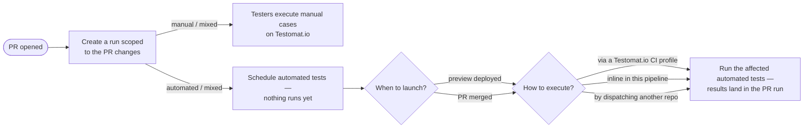
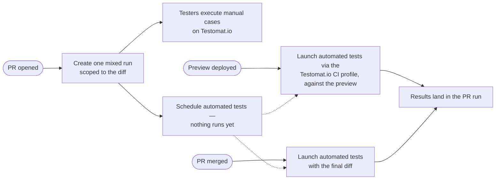

# Setup Change-Aware PR Testing

I set up a project's CI for change-aware PR testing. The knowledge here is the flow model and the decisions to confirm with the user; what gets wired depends on the project's tests:

- manual — testers get a run to start on Testomat.io the moment the PR opens; nothing to execute.
- automated — an execution mode must be chosen: inline in the pipeline, a Testomat.io CI profile, or another workflow/repo.
- mixed — both, sharing one run per PR.

Two skills carry the mechanics — read both before wiring:

- `run-tests-with-testomatio-reporter` — every reporter command and env var the jobs execute.
- `setup-ci-automation` — CI investigation, workflow-authoring rules, diagram conventions, secrets, PR delivery.

> **GOAL: a working pipeline committed to the project's own CI system.** That CI configuration is the one and only finished result. I run locally to author it — I am never part of CI. Do not execute reporter commands while authoring; the one exception is the final battle-test (Step 6), on a PR the user picked.

## Possible flows

When the environment renders Mermaid, post this diagram as a chat message before the first question — never open with a question; it frames everything that follows. When questions go through a form or tool, the diagram must already be on screen in an earlier message.

Never post a diagram bare — follow it immediately with one short paragraph explaining it: this is the general schema of PR testing, for the user to examine before anything is implemented; a run is created when a PR opens, and the user will now choose which types of tests execute (manual, automated, or both) and how the automated ones run — inline in the pipeline, through a Testomat.io CI profile, or by dispatching another repo — and when they launch (preview deploy or merge).

- Manual-only project → only the top branch: the run is complete at creation, testers execute it on Testomat.io, nothing launches.
- Automated-only project → only the bottom branch: the scheduled run launches on a trigger through the chosen mode.
- Mixed project → both branches share one run per PR.

## The coverage map drives everything

A coverage map maps source files/globs to test identifiers; the reporter filters it by the diff so only impacted tests are prepared and run. It is produced by the `qa-test-code-coverage` skill — default `coverage.tests.yml`, one file serving both manual and automated tests. Missing map → delegate to `qa-test-code-coverage`; never hand-write one here. Without a map nothing can be filtered and no pipeline can be wired.

## Critical Constraints

- **Never execute the reporter while authoring — the deliverable is committed CI config.** Sole exception: the user-approved battle-test (Step 6).
- **Battle-test executes tests only for an already-merged PR**; an open PR only gets a run created.
- **Only touch CI config files** — never source or test files.
- Diagrams gate the dialogue: flows diagram before the first question, selected-flow diagram approved before wiring (Step 3).
- Discovery first — delegate to `scan-automation-project` before writing anything.
- Never guess a Testomat.io CI profile name — pick from a list (Testomat.io MCP) confirmed by the user, or ask.
- Say "Testomat.io CI profile" in full, never bare "profile"; every question option explains itself in plain words.
- Avoid presenting the project's full test inventory as the run scope; never print full test lists.
- No coverage map → no pipeline; delegate map creation to `qa-test-code-coverage`.
- The PR-open job creates the run and executes nothing.
- A launch targeting a deployed environment waits for that deployment to finish — gate on the deploy-finished signal, never on the push or the merge event alone.
- The run id persisted at creation is the only link between phases — every launch targets it; never wire shared-run title matching.
- PR comments come from the reporter's own pipes — never script a PR-comment API call.
- The run title is the PR's own title, carried verbatim from the CI's PR-title variable, with the PR number in front. Never append words of your own — no "selective tests", no "affected tests", no framework or scope labels.
- Every run gets that title and a rungroup.

## Workflow

### Step 1 — Discover

- Delegate to `scan-automation-project`: are there manual `.test.md` cases, which e2e framework exists (unit/integration don't count), do automated tests live in this repo or elsewhere.
- The result fixes the project kind — manual, automated, or mixed — and with it which flows apply.
- Investigate the CI with `setup-ci-automation`: which CI system runs PRs and what workflows already exist.
- Locate the coverage map (default `coverage.tests.yml`). Missing → propose creating it and delegate to `qa-test-code-coverage`.

### Step 2 — Present the flows and ask the unknowns

Post the possible-flows diagram, trimmed to the kinds found in Step 1, as its own message with its one-paragraph explanation (what the schema is, which choices the user is about to make) — then ask only what applies. Read the CI files first so you don't ask what's already answered.

Manual tests found — nothing to choose: their part of the run is complete at creation, testers start on Testomat.io immediately.

Automated tests found — ❓ choose the execution mode. Each option in the question must explain itself in plain words — what runs where and who triggers it. In particular spell out what a Testomat.io CI profile is: a CI workflow configuration saved on the Testomat.io project (Settings → CI) that Testomat.io dispatches to execute the tests, with results reporting back into the run.

| Mode                            | When it fits                                                                                                  |
| ------------------------------- | ------------------------------------------------------------------------------------------------------------- |
| Remote — Testomat.io CI profile | a Testomat.io CI profile for the e2e suite exists (Settings → CI); Testomat.io owns runner, env, secrets      |
| Inline — this pipeline          | mobile/simulators, services this pipeline spins up, or an e2e job that already works in this repo             |
| Cross-repo dispatch             | the e2e suite lives in another repo and no Testomat.io CI profile covers it                                   |

- Remote chosen → identify the Testomat.io CI profile, never guess it: Testomat.io MCP connected → fetch the list, present it, ❓ ask the user to choose (profiles differ by workflow and job names); no MCP → ❓ ask for the exact profile name; none exists yet → creating one in Testomat.io (Settings → CI) is a prerequisite; wire the launch step ready to enable.
- No e2e suite anywhere → wire only the manual flow; never fabricate an e2e job.

Then the launch triggers (automated/mixed only):

1. Preview environments — is every commit deployed to a preview server? If yes: what is the observable deploy-finished signal, and where does the preview URL surface?
2. Post-merge timing — launch right on merge, or wait for a staging/production deploy to finish? A deploy gate needs its own observable signal.

And for every kind:

3. Rungroup strategy — week / day / release / milestone.

### Step 3 — Confirm the selected flow

- Draw the flow the answers produced — only the chosen kind, triggers, and execution mode.
- ❓ Present the diagram and get approval; wire nothing until the user accepts it.

Example — mixed project, Testomat.io CI profile, previews confirmed:

### Step 4 — Wire the phases into CI

Author the jobs following `setup-ci-automation`'s workflow-authoring rules; take every command and env var from `run-tests-with-testomatio-reporter`. Manual-only projects get phase (a) alone. One reporter command per job — no `--filter-list` pre-checks.

**(a) PR opened → create the run.**

- Use `start` with the coverage filter; pick the run kind matching the project's tests.
- Set `TESTOMATIO_TITLE` from the CI's PR-number and PR-title variables and nothing else, so the run reads as the PR it belongs to.
- Set `TESTOMATIO_DESCRIPTION` to a direct link to the PR when the CI exposes its URL.
- Provide the platform's comment-pipe token on this job too — `start` posts a pending PR comment with the planned tests (tokens per platform in `run-tests-with-testomatio-reporter`).
- Persist the printed run id with the CI's native value-passing mechanism (artifact, variable, output) — every launch phase reads it; never set up shared-run title matching.
- Run once per PR (on open); pushes to the PR don't recreate runs.
- A PR touching no mapped tests is normal — pass `--warn` so `start` exits 0 and the job stays green; never parse the output.

**(b) Preview deployed → launch against the preview** (only when Step 2 confirmed previews).

- Trigger on the deploy-finished signal and only when it reports success — never on the push.
- Launch into the persisted run id, so results land in the PR's run.
- Remote mode forwards the preview URL as a remote param; inline mode points the runner's own base-URL env at it.
- Manual cases need no launch — testers work through them against the preview by hand.

**(c) PR merged → launch with the final diff.**

- Pin the job to the exact revision this PR landed on the mainline and diff against the mainline state just before it — the branch tip moves as later merges or rebases land.
- Target the persisted run id; pass a fresh coverage filter with the post-merge diff base so the final merged diff decides what runs.
- Step 2 chose a deploy gate → launch only after that staging/production deploy finishes, on its own observable signal.
- Cross-repo mode: trigger the e2e repo's pipeline with the CI's native mechanism, passing the run id and API key into it.

### Step 5 — Deliver: secrets and the PR

Provision secrets and open the pipeline PR as `setup-ci-automation` prescribes, plus what is specific here:

- Provision the PR-comment pipe token alongside the API key (tokens per platform in `run-tests-with-testomatio-reporter`).
- The Testomat.io CI profile for remote launches is configured in Testomat.io (Settings → CI), not stored as a repo secret.
- Put in the PR description: the approved flow diagram, the phases wired, the execution mode chosen, and the secrets/prerequisites to provision before merging.

### Step 6 — Battle-test the setup (on approval)

Prove the pipeline's commands work before the CI ever runs them — by running them once, locally, on a real change.

- ❓ Ask the user for a real PR to validate with — open or already merged — and for approval to create real runs.
- Reproduce the pipeline's diff locally: open PR → check out its branch and diff against the target branch; merged PR → check out the merge commit and diff against the pre-merge tip.
- Create the run exactly as phase (a) does — same kind, same filter, and the title that PR's own title yields.
- Open PR → stop here: the run stays scheduled, nothing executes.
- Merged PR → the change is already in mainline, so launching is safe: run the phase (c) launch against the created run.
- Report every run created — id, kind, and the tests it scoped — and ask the user to review it in Testomat.io: does the scope match what that diff should affect?
- Zero tests matched → report it as a finding, then pick a PR that touches mapped source files together with the user.

### Step 7 — Summarize and hand off

Present the approved flow diagram once more, now marked as wired. Report: the CI targeted and files written; which phases are wired and which were skipped (no previews / no e2e / no Testomat.io CI profile); the chosen execution mode; title scheme and rungroup; the run-id carrier the launch steps read; the battle-test outcome and the runs awaiting the user's review; secrets and prerequisites still to provision; assumptions to confirm. Recommend committing the coverage map alongside the CI config.

## Examples

**Example 1 — mixed project, previews, Testomat.io CI profile**
Discovery finds manual cases and an e2e suite; MCP lists the Testomat.io CI profiles and the user picks the one running the e2e suite; previews confirmed. → Diagram approved, then all three phases wired: mixed run on PR open, preview launch gated on the deployment-success event with the preview URL as a remote param, merge launch with a fresh post-merge filter. Comment pipe enabled.

**Example 2 — e2e lives in another repo, no Testomat.io CI profile**
The user picks cross-repo dispatch from the mode table: the merge job triggers the e2e repo's pipeline via the CI's native mechanism, passing the run id so results land in the prepared run. Note the Testomat.io CI profile option as the simpler future path.

**Example 3 — no coverage map yet**
No `coverage*.yml` found → explain nothing can be filtered without a map; delegate to `qa-test-code-coverage`; wire CI only after the map exists.

**Example 4 — manual-only project**
`scan-automation-project` finds `.test.md` cases and no e2e framework → the flows diagram shows only the manual branch; no execution-mode or trigger questions asked. One phase wired: a manual run per PR, complete at creation — testers start on Testomat.io. Explain that launch phases need an e2e suite first.

## Related skills

`setup-ci-automation` (CI investigation, authoring rules, secrets, PR delivery), `run-tests-with-testomatio-reporter` (the reporter commands every job executes), `qa-test-code-coverage` (creates the coverage map this skill consumes), `scan-automation-project` (mandatory discovery), `qa-e2e-tests-reporting` (install the reporter if the project has no Testomat.io integration yet), `sync-test-cases-with-tms` (manual cases not yet in Testomat.io).
