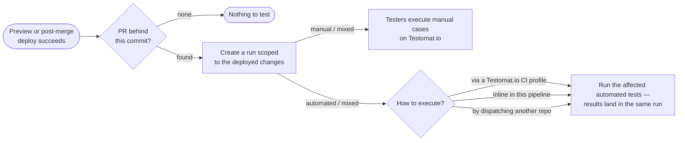
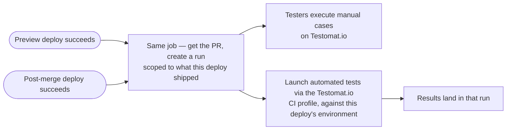

# Setup Change-Aware PR Testing

I set up a project's CI for change-aware PR testing. The knowledge here is the flow model and the decisions to confirm with the user; what gets wired depends on the project's tests:

- manual — testers get a run to work through against the deployed change; nothing to execute.
- automated — an execution mode must be chosen: inline in the pipeline, a Testomat.io CI profile, or another workflow/repo.
- mixed — both, sharing one run per PR.

Two skills carry the mechanics — read both before wiring:

- `run-tests-with-testomatio-reporter` — every reporter command and env var the job executes.
- `setup-ci-automation` — CI investigation, workflow-authoring rules, diagram conventions, secrets, PR delivery.

> **GOAL: a working pipeline committed to the project's own CI system.** That CI configuration is the one and only finished result. I run locally to author it — I am never part of CI. Do not execute reporter commands while authoring; the only exceptions are the Testomat.io CI profile check (Step 2) and the final battle-test (Step 6).

The minimal setup is **one job, gated on the deploy**: it creates the run and launches the tests together. Propose that. Splitting creation and launch across two jobs is possible when the user needs it — the run id is then carried between them.

## Possible flows

When the environment renders Mermaid, post this diagram as a chat message before the first question — never open with a question; it frames everything that follows. When questions go through a form or tool, the diagram must already be on screen in an earlier message.

Never post a diagram bare — follow it immediately with one short paragraph explaining it: this is the general schema of PR testing, for the user to examine before anything is implemented; a run is created once the change is deployed, and the user will now choose which deploys trigger it — a per-PR preview deploy, the post-merge deploy, or both — which types of tests execute (manual, automated, or both), and how the automated ones run — inline in the pipeline, through a Testomat.io CI profile, or by dispatching another repo.

- Manual-only project → only the top branch: the run is complete at creation, testers execute it on Testomat.io, nothing launches.
- Automated-only project → only the bottom branch: the run is created and launched in one job.
- Mixed project → both branches share one run per PR.

## The coverage map drives everything

A coverage map maps source files/globs to test identifiers; the reporter filters it by the diff so only impacted tests are prepared and run. It is produced by the `qa-test-code-coverage` skill — default `coverage.tests.yml`, one file serving both manual and automated tests. Missing map → delegate to `qa-test-code-coverage`; never hand-write one here. Without a map nothing can be filtered and no pipeline can be wired.

## Critical Constraints

- **Never execute the reporter while authoring — the deliverable is committed CI config.** Two approved exceptions: the Testomat.io CI profile check (Step 2) and the battle-test (Step 6).
- **Only touch CI config files** — never source or test files.
- Diagrams gate the dialogue: flows diagram before the first question, selected-flow diagram approved before wiring (Step 3).
- Discovery first — delegate to `scan-automation-project` before writing anything.
- Never guess a Testomat.io CI profile name — pick from a list (Testomat.io MCP) confirmed by the user, or ask. Never wire one that has not been proven to launch.
- Say "Testomat.io CI profile" in full, never bare "profile"; every question option explains itself in plain words.
- Avoid presenting the project's full test inventory as the run scope; never print full test lists.
- No coverage map → no pipeline; delegate map creation to `qa-test-code-coverage`.
- Propose one job gated on the deploy job succeeding; split creation and launch across jobs only if the user needs it, carrying the run id with the CI's value passing.
- Preview deploys and post-merge deploys are equally valid triggers — the same job shape serves both; wire it to each deploy the project has.
- A deployed commit with no PR behind it creates nothing.
- `--kind detect` lets Testomat.io resolve the kind from what the run was scoped to — never hardcode `mixed`.
- The job never fails the deploy pipeline.
- PR comments come from the reporter's own pipes — never script a PR-comment API call.
- The run title is the PR's own title, carried verbatim from the resolved PR, with the PR number in front. Never append words of your own — no "selective tests", no "affected tests", no framework or scope labels.
- Every run gets that title and a rungroup.

## Workflow

### Step 1 — Discover

- Delegate to `scan-automation-project`: are there manual `.test.md` cases, which e2e framework exists (unit/integration don't count), do automated tests live in this repo or elsewhere.
- The result fixes the project kind — manual, automated, or mixed — and with it which flows apply.
- Investigate the CI with `setup-ci-automation`: which CI system runs the project, what workflows exist, and which of them deploy — to which environments.
- Locate the coverage map (default `coverage.tests.yml`). Missing → propose creating it and delegate to `qa-test-code-coverage`.

### Step 2 — Present the flows and ask the unknowns

Post the possible-flows diagram, trimmed to the kinds found in Step 1, as its own message with its one-paragraph explanation (what the schema is, which choices the user is about to make) — then ask only what applies. Read the CI files first so you don't ask what's already answered.

Manual tests found — nothing to choose: their part of the run is complete at creation, testers start on Testomat.io immediately.

Automated tests found — ❓ choose the execution mode. Each option in the question must explain itself in plain words — what runs where and who triggers it. In particular spell out what a Testomat.io CI profile is: a CI workflow configuration saved on the Testomat.io project (Settings → CI) that Testomat.io dispatches to execute the tests, with results reporting back into the run.

| Mode                            | When it fits                                                                                                  |
| ------------------------------- | ------------------------------------------------------------------------------------------------------------- |
| Remote — Testomat.io CI profile | a Testomat.io CI profile for the e2e suite exists (Settings → CI); Testomat.io owns runner, env, secrets      |
| Inline — this pipeline          | mobile/simulators, services this pipeline spins up, or an e2e job that already works in this repo             |
| Cross-repo dispatch             | the e2e suite lives in another repo and no Testomat.io CI profile covers it                                   |

- Remote chosen → identify the Testomat.io CI profile, never guess it: Testomat.io MCP connected → fetch the list, present it, ❓ ask the user to choose (profiles differ by workflow and job names); no MCP → ❓ ask for the exact profile name; none exists yet → creating one in Testomat.io (Settings → CI) is a prerequisite.
- **Then prove that profile launches before wiring anything around it.** ❓ Ask approval — it executes the full suite. Run `npx @testomatio/reporter run --remote <profile-name>` unfiltered, then check on the CI that a job actually started. Exit code 0 only means Testomat.io accepted the dispatch; a profile aimed at the wrong workflow, job, or branch fails silently. Nothing started → fix in Settings → CI and repeat.
- No e2e suite anywhere → wire only the manual flow; never fabricate an e2e job.

And for every kind:

1. ❓ Which deploys trigger the run — the per-PR preview deploy, the post-merge deploy to staging/production, or both. Offer the deploy pipelines found in Step 1. Both exist → wire both; each produces its own run, scoped to what that deploy shipped and tested against that environment.
2. ❓ Rungroup strategy — week / day / release / milestone.

### Step 3 — Confirm the selected flow

- Draw the flow the answers produced — only the chosen kind, deploys, and execution mode.
- ❓ Present the diagram and get approval; wire nothing until the user accepts it.

Example — mixed project, preview and post-merge deploys, Testomat.io CI profile:

### Step 4 — Wire the job into CI

One job in the deploy pipeline, gated on the deploy job succeeding through the CI's native job dependency. The same job serves both deploys — only three things differ:

| Deploy                  | The PR                            | Diff range                        | Tests run against    |
| ----------------------- | --------------------------------- | --------------------------------- | -------------------- |
| Preview deploy (per PR) | the PR that triggered the deploy  | the PR's target branch            | the preview URL      |
| Post-merge deploy       | resolved from the deployed commit | the deployed push's commit range  | staging / production |

Author it following `setup-ci-automation`'s workflow-authoring rules; take every command and env var from `run-tests-with-testomatio-reporter`. No `--filter-list` pre-checks. Manual-only projects get (a) and (b) alone.

**(a) Get the PR.** A preview deploy already carries it. After a merge, ask the platform which PR contains the deployed commit — never parse the commit subject, which yields the branch name for a merge commit. No PR → log it and exit 0; direct commits to the mainline deploy as before and create nothing.

**(b) Create the run.**

- `start --kind detect --format id --warn --filter "coverage:file=<map>,diff=<range>"`, capturing the printed id into `TESTOMATIO_RUN` in the same shell.
- `<range>` is what this deploy shipped — per the table above.
- `--kind detect` — a diff touching only manual tests then yields a manual run, not a mixed one with an empty automated half.
- `TESTOMATIO_TITLE` from the resolved PR's number and title and nothing else; `TESTOMATIO_DESCRIPTION` its URL; `TESTOMATIO_RUNGROUP_TITLE` per Step 2.
- Provide the platform's comment-pipe token so the reporter posts its PR comment (tokens per platform in `run-tests-with-testomatio-reporter`).
- A change touching no mapped tests is normal — `--warn` keeps the job green; never parse the output.
- Check out the deployed revision with full history — the coverage filter diffs.

**(c) Launch the automated tests into that run** (automated/mixed only).

- Same filter and same range as (b), so the launch scope matches what the run was created for.
- Remote: `run --remote <profile-name>`. Inline: `run "<runner command>"`. Cross-repo: trigger the other repo's pipeline with the CI's native mechanism, passing the run id and API key into it.
- The URL of the environment this deploy produced reaches the tests — a remote param for remote mode, the runner's own base-URL env for inline.
- Manual cases need no launch — testers work through them against the deployed change by hand.

### Step 5 — Deliver: secrets and the PR

Provision secrets and open the pipeline PR as `setup-ci-automation` prescribes, plus what is specific here:

- Provision the PR-comment pipe token alongside the API key (tokens per platform in `run-tests-with-testomatio-reporter`).
- The Testomat.io CI profile for remote launches is configured in Testomat.io (Settings → CI), not stored as a repo secret.
- Put in the PR description: the approved flow diagram, the phases wired, the execution mode chosen, and the secrets/prerequisites to provision before merging.

### Step 6 — Battle-test the setup (on approval)

Prove the pipeline's commands work before the CI ever runs them — by running them once, locally, on a real change.

- ❓ Ask the user for a PR to validate with, and for approval to create a real run and launch tests — an open PR when a preview deploy is wired, an already-merged one otherwise.
- Reproduce that deploy's diff locally, per the Step 4 table: open PR → check out its branch and diff against the target branch; merged PR → check out the merge commit and diff against the mainline state just before it.
- Create the run exactly as (b) does — same kind, same filter, and the title that PR's own title yields — then launch as (c) does into it.
- Report the run created — id, kind, and the tests it scoped — and ask the user to review it in Testomat.io: does the scope match what that diff should affect?
- Zero tests matched → report it as a finding, then pick a PR that touches mapped source files together with the user.

### Step 7 — Summarize and hand off

Present the approved flow diagram once more, now marked as wired. Report: the CI targeted and files written; the deploys the job hangs off; the chosen execution mode and the Testomat.io CI profile check result; what was skipped (no e2e / no Testomat.io CI profile); title scheme and rungroup; the battle-test outcome and the run awaiting the user's review; secrets and prerequisites still to provision; assumptions to confirm. Recommend committing the coverage map alongside the CI config.

## Examples

**Example 1 — mixed project, preview and post-merge deploys, Testomat.io CI profile**
Discovery finds manual cases, an e2e suite, a per-PR preview deploy and a deploy to staging on the mainline; MCP lists the Testomat.io CI profiles and the user picks the one running the e2e suite. → The profile is proven with an unfiltered `run --remote` and a check that a job started, the diagram is approved, then the same job is added to both deploy pipelines: get the PR, `start --kind detect` with the coverage filter for that deploy's range, launch remotely against that deploy's URL. Two runs per PR — one on the preview, one on staging. Comment pipe enabled.

**Example 2 — e2e lives in another repo, no Testomat.io CI profile**
The user picks cross-repo dispatch from the mode table: the same job creates the run, then triggers the e2e repo's pipeline via the CI's native mechanism, passing the run id so results land in it. Note the Testomat.io CI profile option as the simpler future path.

**Example 3 — no coverage map yet**
No `coverage*.yml` found → explain nothing can be filtered without a map; delegate to `qa-test-code-coverage`; wire CI only after the map exists.

**Example 4 — manual-only project**
`scan-automation-project` finds `.test.md` cases and no e2e framework → the flows diagram shows only the manual branch; no execution-mode question asked. The job resolves the PR and creates the run, complete at creation — testers start on Testomat.io against the deployed change. Explain that launching needs an e2e suite first.

## Related skills

`setup-ci-automation` (CI investigation, authoring rules, secrets, PR delivery), `run-tests-with-testomatio-reporter` (the reporter commands every job executes), `qa-test-code-coverage` (creates the coverage map this skill consumes), `scan-automation-project` (mandatory discovery), `qa-e2e-tests-reporting` (install the reporter if the project has no Testomat.io integration yet), `sync-test-cases-with-tms` (manual cases not yet in Testomat.io).
