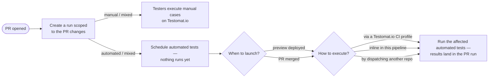
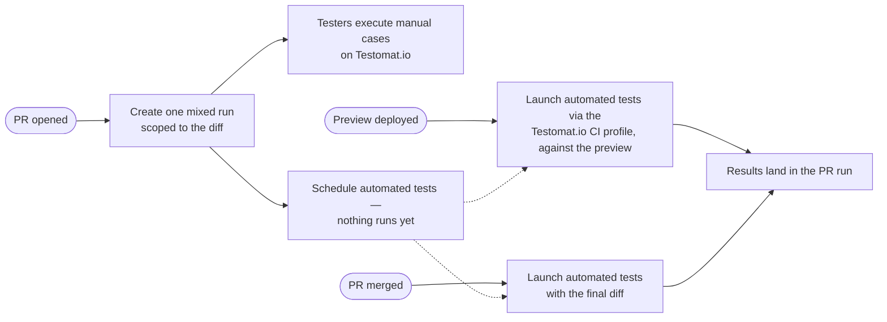

# Setup PR Testing

I set up a project's CI for PR-driven testing. What gets wired depends on the project's tests:

- manual — testers get a run to start on Testomat.io the moment the PR opens; nothing to execute.
- automated — an execution mode must be chosen: inline in the pipeline, a Testomat.io CI profile, or another workflow/repo.
- mixed — both, sharing one run per PR.

Every reporter command the jobs execute is documented in `run-tests-with-testomatio-reporter` — read it before wiring.

> **GOAL: a working pipeline committed to the project's own CI system.** That CI configuration is the one and only finished result. I run locally to author it — I am never part of CI. Do not execute reporter commands while authoring; the one exception is the final battle-test (Step 7), on a PR the user picked.

## Possible flows

Post this diagram as a chat message before the first question — never open with a question; it frames everything that follows. When questions go through a form or tool, the diagram must already be on screen in an earlier message. Render diagrams as Mermaid when the environment displays it; fall back to ASCII otherwise.

Never post a diagram bare — follow it immediately with one short paragraph explaining it: this is the general schema of PR testing, for the user to examine before anything is implemented; a run is created when a PR opens, and the user will now choose which types of tests execute (manual, automated, or both) and how the automated ones run — inline in the pipeline, through a Testomat.io CI profile, or by dispatching another repo — and when they launch (preview deploy or merge).

Keep every diagram clear: verb-first action blocks ("Create a run", "Testers execute manual cases"), decisions as questions, configuration details in the text below — never as blocks, and end at an outcome.

- Manual-only project → only the top branch: the run is complete at creation, testers execute it on Testomat.io, nothing launches.
- Automated-only project → only the bottom branch: the scheduled run launches on a trigger through the chosen mode.
- Mixed project → both branches share one run per PR.

## The coverage map drives everything

A coverage map maps source files/globs to test identifiers; the reporter filters it by the diff so only impacted tests are prepared and run. It is produced by the `qa-test-code-coverage` skill — default `coverage.tests.yml`, one file serving both manual and automated tests. Missing map → delegate to `qa-test-code-coverage`; never hand-write one here. Without a map nothing can be filtered and no pipeline can be wired.

## Method, not snippets

The valuable knowledge here is the flow model and the decisions to confirm with the user. The reporter commands come from `run-tests-with-testomatio-reporter`; translating triggers into a specific CI's YAML/Groovy is yours — you already know how every CI expresses "on PR open", "after deploy finished", "on merge", "carry a value between pipelines", and "don't fail the pipeline". Write that config for the CI in front of you; never bake per-CI workflow files into this skill.

## Critical Constraints

- **Never execute the reporter while authoring — the deliverable is committed CI config.** Sole exception: the user-approved battle-test (Step 7).
- **Battle-test executes tests only for an already-merged PR**; an open PR only gets a run created.
- **Only touch CI config files** — never source or test files.
- Diagrams gate the dialogue: flows diagram before the first question, selected-flow diagram approved before wiring (Step 3), every diagram followed by a one-paragraph explanation.
- Discovery first — delegate to `scan-automation-project` before writing anything.
- Never assume or hardcode the CI system; read the repo, ask if unclear.
- Never guess a Testomat.io CI profile name — pick from a list (Testomat.io MCP) confirmed by the user, or ask.
- Say "Testomat.io CI profile" in full, never bare "profile"; every question option explains itself in plain words.
- Avoid presenting the project's full test inventory as the run scope; never print full test lists.
- No coverage map → no pipeline; delegate map creation to `qa-test-code-coverage`.
- The PR-open job creates the run and executes nothing.
- Preview launches gate on the deploy-finished signal, never on the push.
- Launch jobs never block a PR and never fail a merge/release pipeline.
- PR comments come from the reporter's own pipes — never script a PR-comment API call.
- Every run gets a PR-based title and a rungroup.

## Workflow

### Step 1 — Discover

- Delegate to `scan-automation-project`: are there manual `.test.md` cases, which e2e framework exists (unit/integration don't count), do automated tests live in this repo or elsewhere.
- The result fixes the project kind — manual, automated, or mixed — and with it which flows apply.
- Read the repo's CI config files to identify the CI system. Several CIs or none → ask which one runs PRs.
- Locate the coverage map (default `coverage.tests.yml`). Missing → propose creating it and delegate to `qa-test-code-coverage`.

### Step 2 — Present the flows and ask the unknowns

Post the possible-flows diagram, trimmed to the kinds found in Step 1, as its own message with its one-paragraph explanation (what the schema is, which choices the user is about to make) — then ask only what applies. Read the CI files first so you don't ask what's already answered.

Manual tests found — nothing to choose: their part of the run is complete at creation, testers start on Testomat.io immediately.

Automated tests found — ❓ choose the execution mode. Each option in the question must explain itself in plain words — what runs where and who triggers it. In particular spell out what a Testomat.io CI profile is: a CI workflow configuration saved on the Testomat.io project (Settings → CI) that Testomat.io dispatches to execute the tests, with results reporting back into the run.

| Mode                            | When it fits                                                                                                  |
| ------------------------------- | ------------------------------------------------------------------------------------------------------------- |
| Remote — Testomat.io CI profile | a Testomat.io CI profile for the e2e suite exists (Settings → CI); Testomat.io owns runner, env, secrets      |
| Inline — this pipeline          | mobile/simulators, services this pipeline spins up, or an e2e job that already works in this repo             |
| Cross-repo dispatch             | the e2e suite lives in another repo and no Testomat.io CI profile covers it                                   |

- Remote chosen → identify the Testomat.io CI profile, never guess it: Testomat.io MCP connected → fetch the list, present it, ❓ ask the user to choose (profiles differ by workflow and job names); no MCP → ❓ ask for the exact profile name; none exists yet → creating one in Testomat.io (Settings → CI) is a prerequisite; wire the launch step ready to enable.
- No e2e suite anywhere → wire only the manual flow; never fabricate an e2e job.

Then the launch triggers (automated/mixed only):

1. Preview environments — is every commit deployed to a preview server? If yes: what is the observable deploy-finished signal, and where does the preview URL surface?
2. Post-merge timing — launch right on merge, or wait for a staging/production deploy to finish? A deploy gate needs its own observable signal.

And for every kind:

3. Rungroup strategy — week / day / release / milestone.

### Step 3 — Confirm the selected flow

- Draw the flow the answers produced — only the chosen kind, triggers, and execution mode. Mermaid when supported, ASCII otherwise.
- ❓ Present the diagram and get approval; wire nothing until the user accepts it.

Example — mixed project, Testomat.io CI profile, previews confirmed:

### Step 4 — Wire the phases into CI

Write the jobs in the CI's own syntax; take every command and env var from `run-tests-with-testomatio-reporter`. Manual-only projects get phase (a) alone. Keep each job to its single reporter command plus the CI's native primitives — no log parsing, no `--filter-list` pre-checks, no wrapper bash.

**(a) PR opened → create the run.**

- Use `start` with the coverage filter; pick the run kind matching the project's tests.
- Persist the printed run id with the CI's native value-passing mechanism (artifact, variable, output); fallback is shared-run title matching.
- Run once per PR (on open); pushes to the PR don't recreate runs.
- A PR touching no mapped tests is normal: `start` creates no run and exits 1. Allow the job to fail via the CI's own option (e.g. `continue-on-error`) so such PRs don't get a red mark — never parse the output.

**(b) Preview deployed → launch against the preview** (only when Step 2 confirmed previews).

- Trigger on the deploy-finished signal, never on the push.
- Remote mode forwards the preview URL as a remote param; inline mode points the runner's own base-URL env at it.
- Manual cases need no launch — testers work through them against the preview by hand.

**(c) PR merged → launch with the final diff.**

- Target the persisted run id; pass a fresh coverage filter with the post-merge diff base so the final merged diff decides what runs.
- Cross-repo mode: trigger the e2e repo's pipeline with the CI's native mechanism, passing the run id, API key, and title env into it.
- Keep the job non-blocking and off the release's critical path.

### Step 5 — Ensure secrets are set

- Store the project API key as `TESTOMATIO_<project_slug>` in the CI's secret store; map it to the `TESTOMATIO` env var in every job that calls the reporter. ❓ Slug unknown → ask the user.
- Tell the user exactly where to add it: name the secret-store location the CI at hand uses for this repo/pipeline and the exact secret name to type.
- Provision the PR-comment pipe token the same way (tokens per platform in `run-tests-with-testomatio-reporter`).
- ❓ Ask the user to confirm the secrets are in place before the pipeline PR merges — a pipeline with missing secrets fails on its first PR.
- The Testomat.io CI profile for remote launches is configured in Testomat.io (Settings → CI), not stored as a repo secret.

### Step 6 — Suggest a PR with the new workflow

- Commit the CI config on a branch and suggest opening a PR through the project's normal flow — the pipeline lands reviewed, never pushed straight to the default branch.
- Put in the PR description: the approved flow diagram, the phases wired, the execution mode chosen, and the secrets/prerequisites the reviewers must provision before merging.
- Where the CI runs PR-triggered workflows from the branch itself, point out that this very PR will exercise the PR-opened phase.

### Step 7 — Battle-test the setup (on approval)

Prove the pipeline's commands work before the CI ever runs them — by running them once, locally, on a real change.

- ❓ Ask the user for a real PR to validate with — open or already merged — and for approval to create real runs.
- Reproduce the pipeline's diff locally: open PR → check out its branch and diff against the target branch; merged PR → check out the merge commit and diff against the pre-merge tip.
- Create the run exactly as phase (a) does — same kind, same filter — with a title that marks it as a battle-test.
- Open PR → stop here: the run stays scheduled, nothing executes.
- Merged PR → the change is already in mainline, so launching is safe: run the phase (c) launch against the created run.
- Report every run created — id, kind, and the tests it scoped — and ask the user to review it in Testomat.io: does the scope match what that diff should affect?
- Zero tests matched → report it as a finding, then pick a PR that touches mapped source files together with the user.

### Step 8 — Summarize and hand off

Present the approved flow diagram once more, now marked as wired. Report: the CI targeted and files written; which phases are wired and which were skipped (no previews / no e2e / no Testomat.io CI profile); the chosen execution mode; title scheme and rungroup; how the launch steps find the prepared run (run id carrier or shared title); the battle-test outcome and the runs awaiting the user's review; secrets and prerequisites still to provision; assumptions to confirm. Recommend committing the coverage map alongside the CI config.

## Examples

**Example 1 — mixed project, previews, Testomat.io CI profile**
Discovery finds manual cases and an e2e suite; MCP lists the Testomat.io CI profiles and the user picks the one running the e2e suite; previews confirmed. → Diagram approved, then all three phases wired: mixed run on PR open, preview launch gated on the deployment-success event with the preview URL as a remote param, merge launch with a fresh post-merge filter. Comment pipe enabled.

**Example 2 — e2e lives in another repo, no Testomat.io CI profile**
The user picks cross-repo dispatch from the mode table: the merge job triggers the e2e repo's pipeline via the CI's native mechanism, passing the run id so results land in the prepared run. Note the Testomat.io CI profile option as the simpler future path.

**Example 3 — no coverage map yet**
No `coverage*.yml` found → explain nothing can be filtered without a map; delegate to `qa-test-code-coverage`; wire CI only after the map exists.

**Example 4 — manual-only project**
`scan-automation-project` finds `.test.md` cases and no e2e framework → the flows diagram shows only the manual branch; no execution-mode or trigger questions asked. One phase wired: a manual run per PR, complete at creation — testers start on Testomat.io. Explain that launch phases need an e2e suite first.

## Related skills

`run-tests-with-testomatio-reporter` (the reporter commands every job executes), `qa-test-code-coverage` (creates the coverage map this skill consumes), `scan-automation-project` (mandatory discovery), `qa-e2e-tests-reporting` (install the reporter if the project has no Testomat.io integration yet), `sync-test-cases-with-tms` (manual cases not yet in Testomat.io).
